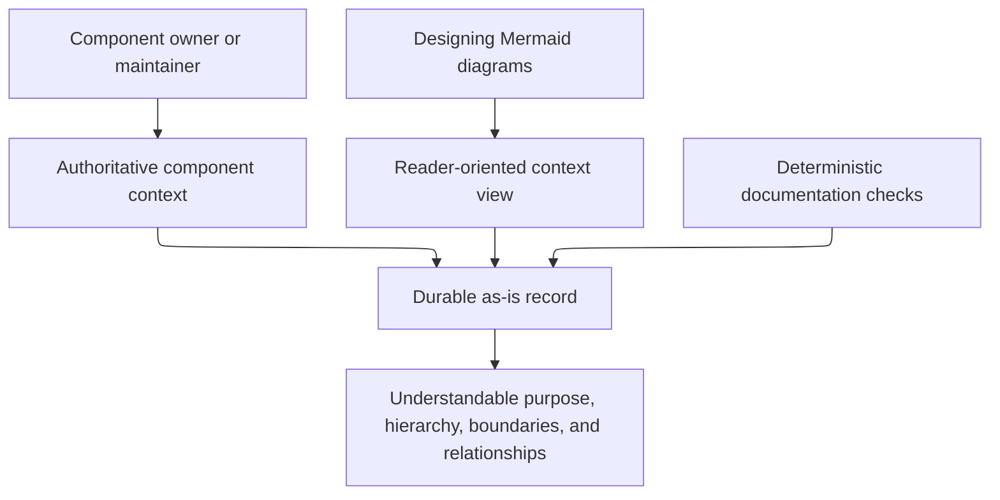

# Managing As-Is Documents - as-is

## Purpose

Maintain durable `as-is.md` records that explain the purpose, design, relationships, boundaries, hierarchy, and navigational context of repository components. This component provides the reusable procedure for creating, structuring, and maintaining those records without turning them into task, backlog, configuration, or runtime authorities.

## Design

The skill declares the durable record model, diagram and navigation model, example structure, creation, alignment, and replacement model, and compact ordered application model for an owned record. Initial-record, semantic-alignment, controlled-replacement, and migration-or-retirement treatments are selected from evidence about the approved component boundary and implementation context. Its optional hierarchical reconciliation application mode admits a parent only from its own allowed evidence and final immediate-child records for one baseline; it keeps the canonical record graph and task-control topology separate. It keeps authoritative purpose, boundaries, relationships, and decisions in prose and direct links; diagrams provide bounded reader-oriented views. Its consolidated diagram examples keep the parent-container convention, named diagram subsections, root-to-current breadcrumbs, navigation fallback, and separately scoped non-container views together. It composes with the generic Mermaid diagram design skill for Mermaid mechanics, functional framing, pre-render layout plans, clear labels, readable taller/narrower layouts, and technical-detail limits.

[as-is](../../as-is.md#design) / [Skills](../as-is.md#design) / **Managing As-Is Documents**

### Record-maintenance context flow

- Pre-render layout plan: repository Markdown consumers with no fixed dimensions or configured renderer; taller-than-wide context flow; six short-labeled nodes and six edges; top-to-bottom routing represents contextual contribution rather than execution order; renderer-specific geometry remains untested.

The record shape uses Purpose, optional immediate Components, Design, optional Relationships, focused ownership facts when needed, and distinct direct context links. A parent record's Design begins with its box-oriented container diagram; non-parent records do not receive container diagrams. A component boundary is the directory containing `as-is.md`; child records are explicit components, while ordinary directories and grandchildren are not promoted into the record. Structural views explain stable containment or neighborhood; temporal views explain one bounded consequential flow, and durable flow views disclose material failure or recovery behavior without turning routine implementation into architecture. Active task state belongs in the configured task record; history placement follows the target project's applicable record convention. Parent context is never ambient: each linked immediate-child box is paired with a Components table that supplies the sole Markdown catalog and renderer fallback; the root-to-current breadcrumb and a Markdown fallback for any separately linked diagram target cover their own routes, while Links add only context those paths do not already provide. Source and test files remain absent unless their exact behavior is indispensable to the reader.

This skill is used by agents and orchestrators that maintain component context; it does not select, authorize, start, observe, recover, cancel, or delegate agents. The existing orientation utility is read-only supporting infrastructure, not an authority-bearing workflow.

`content-test.ts` validates the stable documentation contract, including root-to-current breadcrumbs, sole Components-table child catalogs, linked-node fallback pairs, parent-Link catalog exclusions, and the cross-skill pre-render layout-plan contract; `scripts/orient.test.ts` exercises only read-only orientation support; no live test can exercise record-maintenance execution because its supported interface is repository-authored Markdown rather than an executable API. Residual risk: focused structural and link inspection cannot prove agent interpretation or renderer-specific diagram behavior.

## Links

- [SKILL.md](SKILL.md) — authoritative declarative record, creation, alignment, replacement, and compact ordered application models, plus linked diagram references.
- [diagram-examples.md](diagram-examples.md) — consolidated structural-container, navigation-fallback, and separately scoped diagram-view examples.
