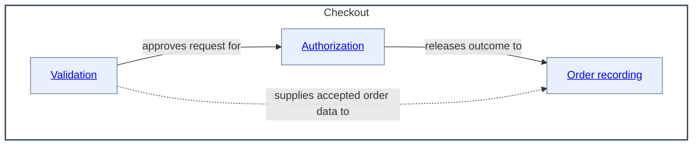

# Balanced Component Container Diagram Example

This example is intentionally separate from the reusable Mermaid skill. It
shows the `as-is.md`-specific structural and navigation convention for a
parent component with immediate children.

## Scope

The `Checkout` component owns three documented child components. The diagram
shows only `Checkout` and those immediate children. The children have sibling
relationships, so the diagram uses a balanced relationship-map layout rather
than a top-to-bottom flow. The nearby parent link supports reverse navigation;
it is not a synthetic diagram node or edge.

Parent: [Commerce Platform](../../as-is.md#design)

## Why this representation

- The subgraph title is the actual component name, not `Parent` or a synthetic
  parent node.
- Child components are boxes nested inside the parent container.
- Sibling relationships use explicit, semantically labeled arrows.
- The parent link is nearby Markdown navigation rather than a diagram edge.
- The outer `LR` layout gives the container a balanced relationship-map shape;
  it does not imply a runtime sequence.
- Child names target each child's `as-is.md#design` section.

If the renderer does not support linked HTML labels or preserve SVG links, the
Markdown `Components` table remains the authoritative fallback. Do not add a
container diagram to a record unless the children are independently documented
components with their own `as-is.md` records.
