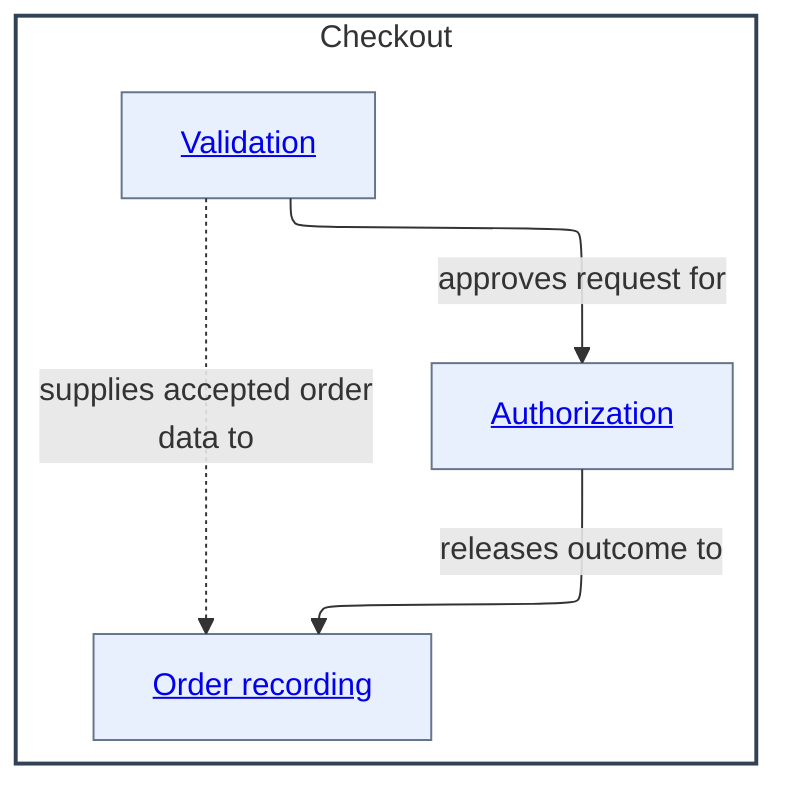
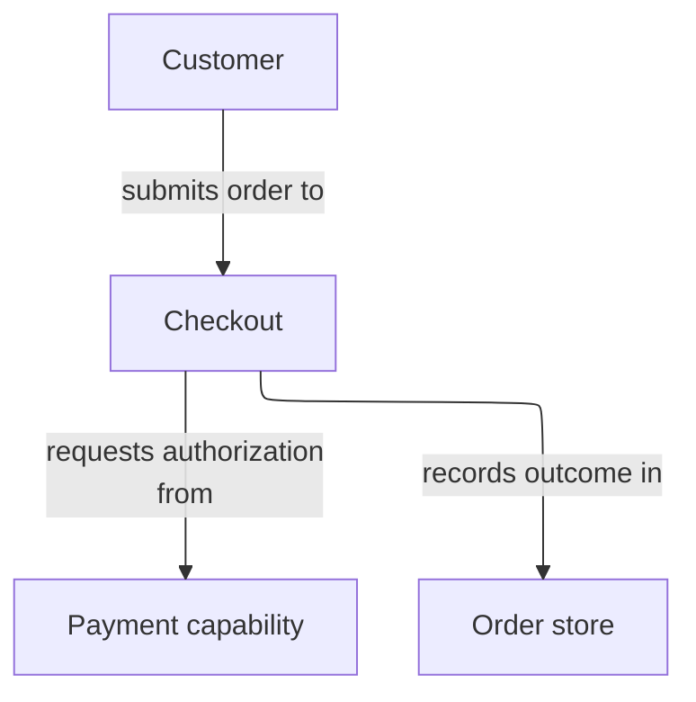
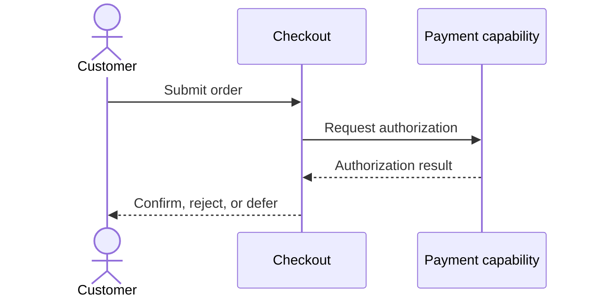
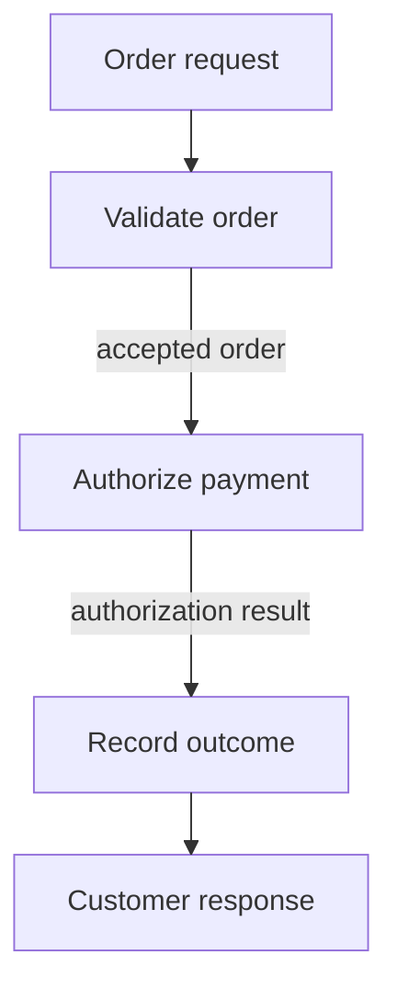
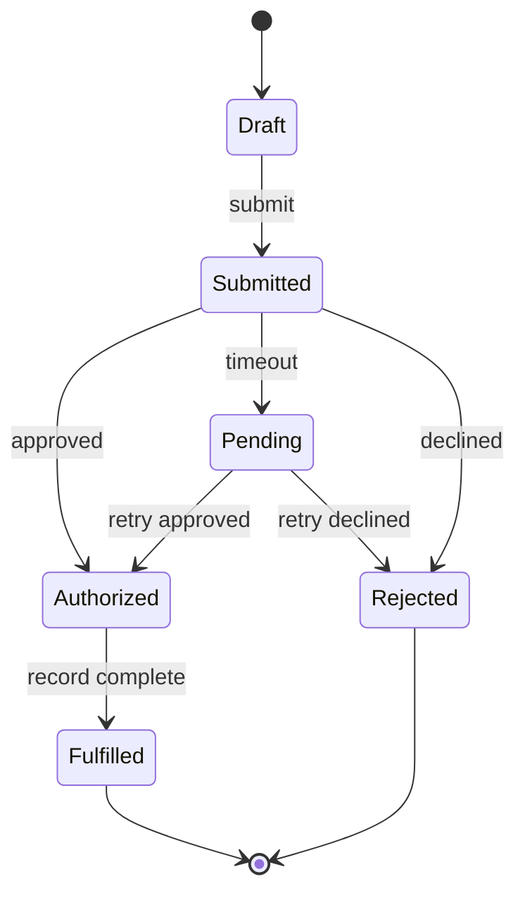
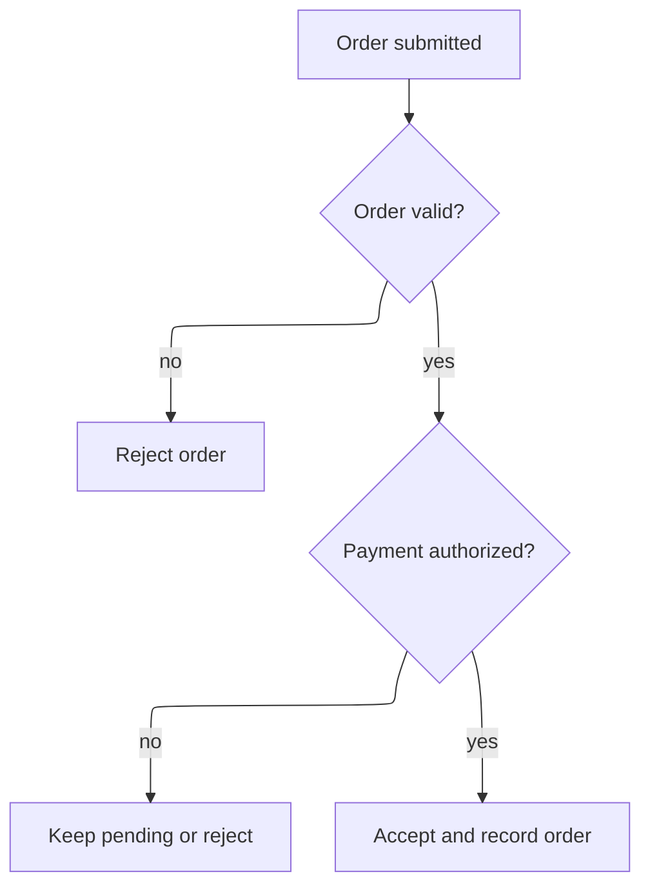
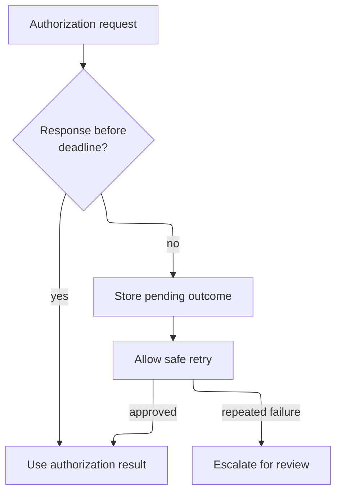
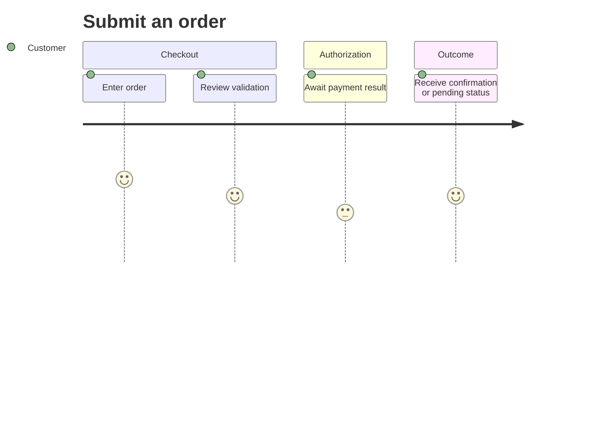

# As-Is Diagram Examples

These examples are reusable patterns for `as-is.md` records. Each view states its question, scope, layout, and arrow meaning so readers do not mistake a layout choice for architecture. Replace the illustrative names and edges only with relationships supported by the component's authoritative context.

## Pre-render layout plan

Plan the view before writing its Mermaid fence. Record the host or embed surface that constrains it, the intended shape, a legible node/edge/label density budget, grouping and routing direction, and any supported exception or residual risk. These are constraints and reader-intent decisions, not invented numeric dimensions; use a supplied width, height, or aspect ratio only when the target host authoritatively provides one.

```markdown
- Render-surface constraint: repository Markdown consumers; no fixed dimensions or configured renderer supplied
- Shape target: taller-than-wide balanced relationship map
- Density budget: three child boxes, three labeled sibling arrows, short labels
- Grouping and routing: immediate children nested in Checkout; arrows express sibling relationships, not runtime order
- Exception or residual risk: renderer-specific geometry remains untested
```

## Structural container

Use for a parent component with independently documented immediate children. Containment is nested boxes; sibling relationships are explicit labeled arrows. Use a balanced relationship-map layout rather than implying sequence.

### Complete parent-record example

The `Checkout` component owns three documented child components. The diagram shows only `Checkout` and those immediate children. The `**Lineage**: ` line supports reverse navigation; it is not a synthetic diagram node or edge.

```markdown
## Components

| Component | Purpose |
| --- | --- |
| [Validation](./validation/as-is.md#design) | Validates checkout requests. |
| [Authorization](./authorization/as-is.md#design) | Authorizes accepted requests. |
| [Order recording](./order-recording/as-is.md#design) | Records authorized outcomes. |

## Design

- Kind: `structural-container`
- Scope: `checkout`
- Visible levels: `Checkout` and immediate children
- Layout: balanced taller, narrower relationship map
- Render-surface constraint: repository Markdown consumers; no fixed dimensions or configured renderer supplied
- Shape target: taller-than-wide balanced relationship map
- Density budget: three child boxes, three labeled sibling arrows, short labels
- Grouping and routing: immediate children nested in Checkout; arrows express sibling relationships, not runtime order
- Exception or residual risk: renderer-specific geometry remains untested
- Arrow meaning: labeled sibling capability or responsibility relationship

**Lineage**: [Commerce Platform](../../as-is.md#design) / **Checkout**

### Structural container
```



### Why this representation

- The subgraph title is the actual component name, not `Parent` or a synthetic parent node.
- Child components are boxes nested inside the parent container.
- Sibling relationships use explicit, semantically labeled arrows.
- The `**Lineage**: ` line is root-to-current Markdown navigation rather than a diagram edge.
- The ELK/TB layout prefers a taller, narrower relationship map; it does not imply a runtime sequence.
- Child box labels target the corresponding `Components` table entries.

The child-box links provide interactive navigation when supported. The matching Markdown `Components` table remains the sole immediate-child catalog and authoritative fallback when a renderer strips diagram links. The diagram-link and Markdown-fallback pair is intentional; do not repeat child targets or ordinary direct-child contracts in `## Links` unless an artifact adds distinct parent-level working context. Do not add a container diagram to a record unless the children are independently documented components with their own `as-is.md` records.

## Context map

Use when the reader needs the component's functional neighbors and boundaries, not its internal chronology. Keep hidden providers and distant descendants out of the view.

```markdown
- Kind: `context-map`
- Scope: `checkout boundary`
- Visible levels: `Checkout` and direct neighboring capabilities
- Layout: top-to-bottom
- Arrow meaning: functional dependency or capability exchange
```

### Context map



## Scenario or sequence flow

Use for a consequential request, journey, or handoff where time order matters. Sequence participants remain horizontal while messages progress vertically.

```markdown
- Kind: `scenario`
- Scope: `commerce platform`
- Visible participants: `Customer`, `Checkout`, `Payment capability`
- Layout: sequence participants horizontal; messages progress vertically
- Arrow meaning: temporal request, response, or outcome
```

### Scenario sequence



## Data flow

Use for a consequential pipeline in which information is transformed or validated. Prefer vertical flow for long pipelines.

```markdown
- Kind: `data-flow`
- Scope: `order submission`
- Visible levels: selected processing stages
- Layout: top-to-bottom
- Arrow meaning: data or result progression
```

### Data flow



## State flow

Use when lifecycle states and legal transitions are architecturally meaningful. Put guards, actions, and ownership in prose or a transition table when labels alone are insufficient.

```markdown
- Kind: `state-flow`
- Scope: `order authorization`
- Visible levels: lifecycle states owned by Checkout
- Layout: top-to-bottom progression
- Arrow meaning: state transition caused by an event or result
```

### State flow



## Decision flow

Use when guards produce materially different outcomes or authority decisions. Label branches with the condition or outcome, not merely `yes` and `no` when a more meaningful phrase is available.

```markdown
- Kind: `decision-flow`
- Scope: `checkout acceptance`
- Visible levels: decision and consequential outcomes
- Layout: top-to-bottom
- Arrow meaning: guarded branch or resulting decision
```

### Decision flow



## Recovery flow

Use when failure, retry, escalation, compensation, or cancellation changes the architecture or observable outcome. Do not repeat routine transport behavior.

```markdown
- Kind: `recovery-flow`
- Scope: `payment timeout`
- Visible levels: Checkout, payment capability, and recovery outcome
- Layout: top-to-bottom progression
- Arrow meaning: failure, retry, escalation, or compensation handoff
```

### Recovery flow



## Actor journey

Use when the reader needs the experience across responsibilities rather than component ownership or exact message order. Keep the journey focused on a single actor and outcome.

```markdown
- Kind: `journey`
- Scope: `customer order submission`
- Visible levels: actor experience across bounded responsibilities
- Layout: journey stages progress left-to-right
- Arrow meaning: experience progression; details belong in stage text
```

### Actor journey



## Choosing among views

- Use a **structural container** for stable ownership and immediate children.
- Use a **context map** for neighboring capabilities and boundaries.
- Use a **scenario/sequence** view for time-ordered interactions.
- Use a **data flow** for transformations and pipelines.
- Use a **state flow** for lifecycle and legal transitions.
- Use a **decision flow** for guards and materially different outcomes.
- Use a **recovery flow** for consequential failure and repair behavior.
- Use an **actor journey** for user experience across responsibilities.

A record may contain more than one view when each answers a different reader question. Do not add every view by default; standard behavior remains implicit unless an exception or consequence makes it worth documenting.
