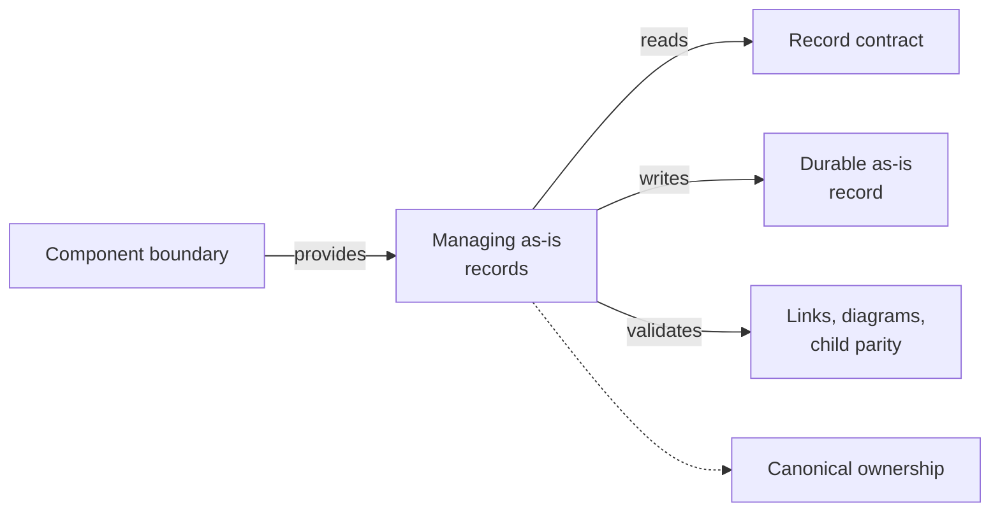

# Managing as-is Records - as-is

## Purpose
Create, align, and navigate durable component records.

## Design

The skill resolves component context, applies the record contract, updates Purpose, Components, Design, Relationships, and navigation, and validates links, diagrams, and child parity; no composition table, workflow example, or tool-access row is cited for it, so it stands alongside the other master skills as a directly selectable records outcome rather than a composition stage. It establishes fit, not permission: it grants no tools or authority, must keep task state out of records, must preserve canonical ownership (a child updates only its own records), and stops when component ownership or boundary is unclear.

**Lineage**: [as-is](../../as-is.md#design) / [Skills](../as-is.md#design) / **Managing as-is Records**

### As-is record flow

## Links
- [SKILL.md](SKILL.md) — authoritative procedure and contract.
- [../as-is.md](../../as-is.md) — concise capability catalog entry.