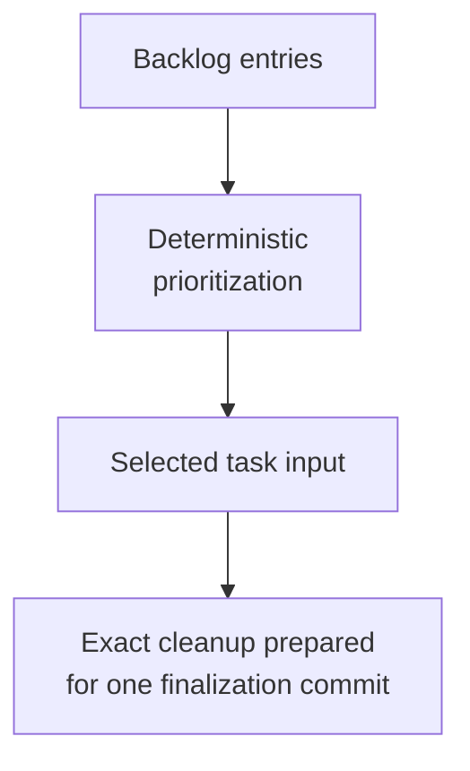

# Managing Backlog - as-is

## Purpose

Maintain and prioritize bounded work proposals separately from active component
tasks, using durable recording tables and a deterministic query-time display.

## Design

The component is organized around the following relationships and flow.

**Lineage**: [as-is](../../as-is.md#design) / [Skills](../as-is.md#design) / **Managing Backlog**

### Backlog prioritization flow

The backlog is a planning index, not task authority. Each component backlog uses
a stable table with `id`, `status`, integer `user preference`, integer `system
preference`, `purpose`, `description`, `dependencies`, `acceptance`, and
`notes`. The component is derived from the backlog path rather than duplicated
in each source row.

Backlog status is `open`, `selected`, or `deferred`; active execution state
belongs to transient `tasks.md` records and completed summaries belong to
`changelog.md`. Dependencies use `component:id` references. Legacy string
priorities migrate deterministically to user preferences (`High=3`,
`Medium=2`, `Low=1`, `Deferred/absent=0`); uncertain legacy dependency text is
preserved in notes instead of being guessed or discarded.

The query does not persist `weight`. It computes
`status value + user preference + system preference + sum(dependent weights)`
with status values `open=0`, `selected=4`, and `deferred=-2`, then sorts
descending with a stable lexical tie-break. The dependent sum is intentional:
it gives fan-out value to prerequisites, whereas an average can hide the number
of items unblocked. Cycles are handled deterministically.

The conversational display contract is strict: for “Show me the backlog,
please.”, the agent runs the deterministic query and returns the top 10 weighted
rows by default without manually abbreviating them. An explicit request may use
a different bounded limit or the complete view. The representation columns are
exactly `weight`, `component`, `id`, `status`, `purpose`, `description`,
`dependencies`, and `notes`. `validateQueryRepresentation` and the focused tests protect this
contract after a fresh Pi validation found a five-column summary that omitted
description, dependencies, and notes.

Cleanup is evidence-gated and component-owned. `cleanupCompletedBacklogs`
prepares removal only for rows whose exact IDs occur in the owning
`changelog.md` alongside a completion term; it preserves ambiguous,
cross-component, and merely mentioned items. The prepared row removal is part
of the same finalization patch as the changelog summary and configured task
cleanup, and must not be committed separately. It does not replace
task-management reconciliation or invent completion status. The cleanup
command reports each selected item and its evidence for review.

## Links

- [SKILL.md](SKILL.md) — authoritative backlog procedure.
- [../../backlog.md](../../backlog.md) — repository backlog index.
