# Master skills - as-is

## Purpose

Organize the adopted master skills that compose authoritative workflows and bounded component outcomes.

## Components

| Component | Purpose |
| --- | --- |
| [Building components](building-components/as-is.md#design) | Build bounded components and produce durable handoffs. |
| [Committing completed work](committing-completed-work/as-is.md#design) | Create scoped commits for validated completed work. |
| [Consulting humans](consulting-humans/as-is.md#design) | Guide concise, agency-preserving consultation. |
| [Designing Mermaid diagrams](designing-mermaid-diagrams/as-is.md#design) | Design bounded Mermaid diagrams for complete component context. |
| [Exploring execution evidence](exploring-execution-evidence/as-is.md#design) | Investigate traces and readable sessions. |
| [Implementing tasks](implementing-tasks/as-is.md#design) | Run bounded component-task lifecycle. |
| [Maintaining components](maintaining-components/as-is.md#design) | Perform evidence-based component housekeeping. |
| [Making changes](making-changes/as-is.md#design) | Apply bounded, validated changes to components. |
| [Managing as-is records](managing-as-is-records/as-is.md#design) | Create and maintain durable component records. |
| [Managing backlogs](managing-backlogs/as-is.md#design) | Prioritize bounded work proposals. |
| [Managing changelogs](managing-changelogs/as-is.md#design) | Maintain component changelogs. |
| [Spawning subagents](spawning-subagents/as-is.md#design) | Launch and observe bounded Pi subprocesses. |

## Design

**Lineage**: [as-is](../../as-is.md#design) / [Skills](../as-is.md#design) / **Master skills**

```mermaid
%%{init: {"securityLevel": "loose"}}%%
flowchart LR
    subgraph Master["Master skills"]
        BuildingComponents["<a href='./building-components/as-is.md#design'>Building components</a>"]
        CommittingCompletedWork["<a href='./committing-completed-work/as-is.md#design'>Committing completed work</a>"]
        ConsultingHumans["<a href='./consulting-humans/as-is.md#design'>Consulting humans</a>"]
        DesigningMermaidDiagrams["<a href='./designing-mermaid-diagrams/as-is.md#design'>Designing Mermaid diagrams</a>"]
        ExploringExecutionEvidence["<a href='./exploring-execution-evidence/as-is.md#design'>Exploring execution evidence</a>"]
        ImplementingTasks["<a href='./implementing-tasks/as-is.md#design'>Implementing tasks</a>"]
        MaintainingComponents["<a href='./maintaining-components/as-is.md#design'>Maintaining components</a>"]
        MakingChanges["<a href='./making-changes/as-is.md#design'>Making changes</a>"]
        ManagingAsIsRecords["<a href='./managing-as-is-records/as-is.md#design'>Managing as-is records</a>"]
        ManagingBacklogs["<a href='./managing-backlogs/as-is.md#design'>Managing backlogs</a>"]
        ManagingChangelogs["<a href='./managing-changelogs/as-is.md#design'>Managing changelogs</a>"]
        SpawningSubagents["<a href='./spawning-subagents/as-is.md#design'>Spawning subagents</a>"]
    end
    classDef component fill:#f8fafc,fill-opacity:0.1,stroke:#334155,stroke-width:2px
    classDef child fill:#2563eb,fill-opacity:0.1,stroke:#64748b,stroke-width:1px
    class Master component
    class BuildingComponents,CommittingCompletedWork,ConsultingHumans,DesigningMermaidDiagrams,ExploringExecutionEvidence,ImplementingTasks,MaintainingComponents,MakingChanges,ManagingAsIsRecords,ManagingBacklogs,ManagingChangelogs,SpawningSubagents child
```

## Links

- [../as-is.md](../as-is.md) — Skills namespace record and adopted catalog.
- [../../design-principles.md](../../design-principles.md) — repository-wide authority and design principles.
