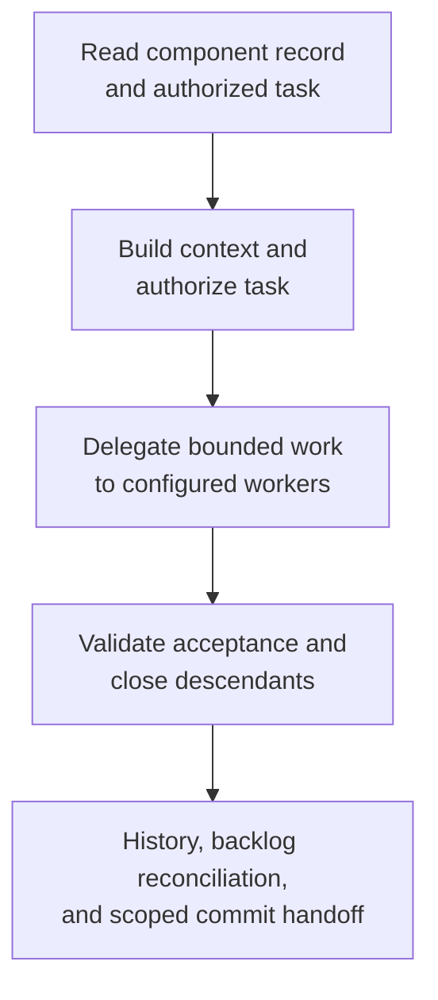

# Building components - as-is

## Purpose
Build bounded component tasks with delegation, validation, history, and completion handoffs.

## Design

The skill is a master composition that builds context, authorizes the component task, delegates bounded work, enforces acceptance and descendant gates, and prepares the owning completion handoff. Its governing composition is the skills-draft workflow: resolving-scopes → building-context → implementing-tasks → writing-code or applying-bounded-edits → writing-tests → validating-changes → managing-changelogs → preparing-scoped-commits, with the target-design text composition carried as the named alternative binding at adoption time. The skill grants no tools: admission requires the agent to hold every tool for its selected path, otherwise the workflow stops with a bounded missing-capability blocker; delegation runs only through configured workers, and child boundaries are stopped at rather than crossed.

### Component task flow

**Lineage**: [as-is](../../../as-is.md#design) / [Skills](../../as-is.md#design) / **Building components**

## Links
- [SKILL.md](SKILL.md) — authoritative procedure and contract.
- [../../as-is.md](../../as-is.md) — concise capability catalog entry.