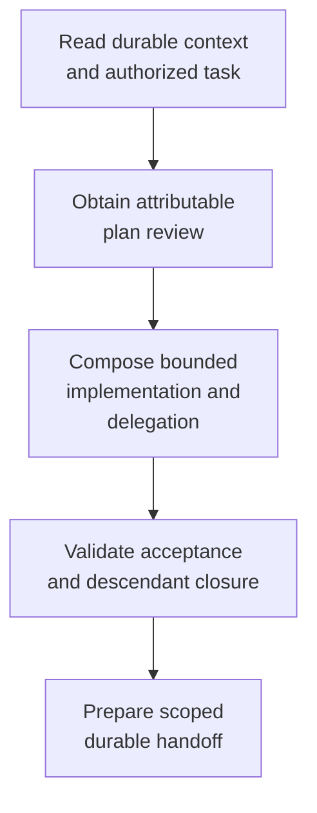

# Building components - as-is

## Purpose

Build bounded component tasks with delegation, validation, history, and completion handoffs while the receiving parent retains semantic integration and completion authority.

## Design

The skill is the master composition for reading durable context, obtaining attributable plan review, preparing configured delegation, and composing implementation, validation, history, recovery, and completion procedures. It grants no tools or authority. The role and task record remain authoritative for admission, scope, integration, and completion decisions.

**Lineage**: [as-is](../../../as-is.md#design) / [Skills](../../as-is.md#design) / **Building components**

### Component task flow

| Concern | Rule |
| --- | --- |
| Composition | Compose `building-context`, task lifecycle, bounded changes, tests, validation, changelog, and scoped completion procedures as applicable. |
| Delegation | Stop at separately owned child boundaries and use configured workers through the approved delegation and launch procedures. |
| Integration | Require committed, scoped, validated child evidence; record source, result, and integrated SHAs; handle only in-scope conflicts; prove ancestry and run parent-side validation. |
| Closure | Keep `pending-parent-integration` non-terminal, close descendants, consolidate related results, and record `no-separate-integration` for parent-owned, same-component, or no-change work. |
| Authority | The receiving role owns semantic integration and completion; this skill grants no tools or authority and does not replace the task record. |
| Runtime boundary | Launcher and control-plane runtime provide mechanical handoff and ancestry evidence; this skill record does not claim runtime enforcement. |

## Links

- [SKILL.md](SKILL.md) — authoritative component-building procedure.
- [../../as-is.md](../../as-is.md#design) — concise capability catalog entry.
- [../../../agents/component-builder/as-is.md#design](../../../agents/component-builder/as-is.md#design) — role ownership and boundary.
