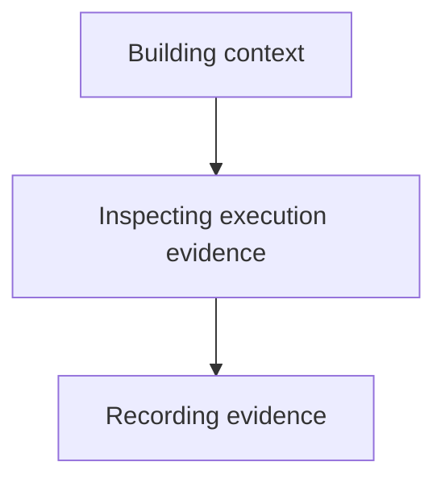

# Exploring Execution Evidence - as-is

## Purpose
Investigate bounded execution evidence and produce a cautious finding.

## Design

The skill builds the smallest evidence context, inspects readable traces or sessions, correlates observations, and reports findings; it fits into the reusable composition `building-context → inspecting-execution-evidence → recording-evidence` and complements the other read-only master skills that consume evidence without acting on it. It establishes fit only: it grants no tools or authority, never edits, launches, or authorizes work, does not treat telemetry as task state, and cannot perform any mutation or task lifecycle action on its own.

**Lineage**: [as-is](../../../as-is.md#design) / [Skills](../../as-is.md#design) / **Exploring Execution Evidence**

### Evidence investigation flow

## Links
- [SKILL.md](SKILL.md) — authoritative procedure and contract.
- [../../as-is.md](../../as-is.md) — concise capability catalog entry.