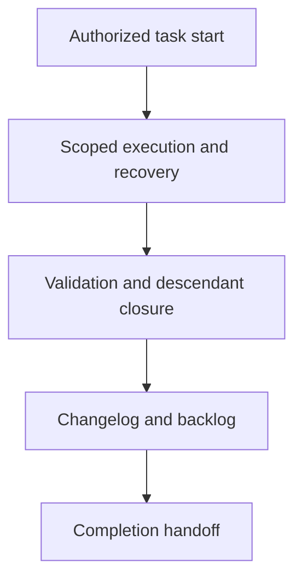

# Implementing Tasks - as-is

## Purpose
Run the existing task lifecycle for authorized bounded requirements.

## Design

The skill follows the existing task applicability, start, execution, recovery, validation, descendant closure, changelog, backlog, and completion procedures without changing their authority; it is the component-based-composition master positioned between context/change-method selection and the code, validation, and history masters (`implementing-tasks → writing-code or applying-bounded-edits → writing-tests → validating-changes → locating-changelogs → managing-changelogs`). It establishes fit, not permission: it grants no tools or authority, may not alter task authority or the protocol's gates, and must stop on missing authorization, missing capability, or unresolved task applicability.

**Lineage**: [as-is](../../../as-is.md#design) / [Skills](../../as-is.md#design) / **Implementing Tasks**

### Task lifecycle flow

## Links
- [SKILL.md](SKILL.md) — authoritative procedure and contract.
- [../../as-is.md](../../as-is.md) — concise capability catalog entry.