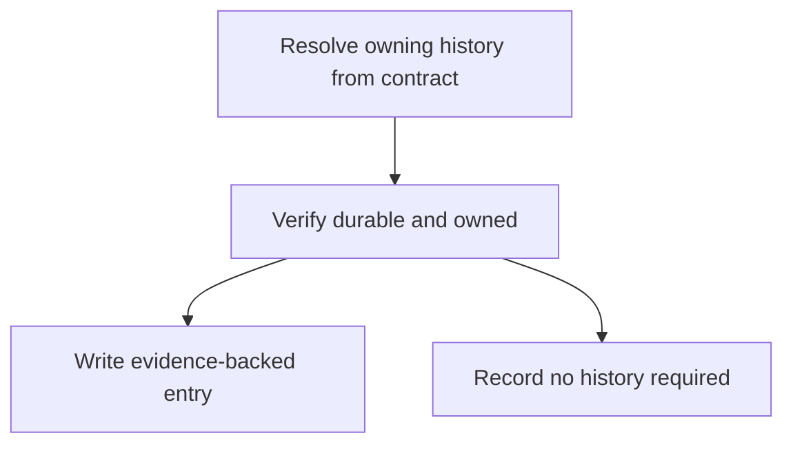

# Managing Changelogs - as-is

## Purpose
Resolve and maintain durable histories independently of component-task use.

## Design

The skill resolves the owning history from explicit task, component, project, or root contracts, writes concise evidence-backed entries, and explicitly records when no durable history is required; it is independently usable — it terminates the reusable change compositions after `locating-changelogs`, serves the component-task completion path through the existing task protocol, and must not select a changelog merely because it is the nearest file with that name. It establishes fit, not permission: it grants no tools or authority, may not infer a history contract or a no-history outcome, and stops when the owning history or applicable contract is unresolved.

**Lineage**: [as-is](../../as-is.md#design) / [Skills](../as-is.md#design) / **Managing Changelogs**

### History resolution flow

## Links
- [SKILL.md](SKILL.md) — authoritative procedure and contract.
- [../as-is.md](../as-is.md) — concise capability catalog entry.