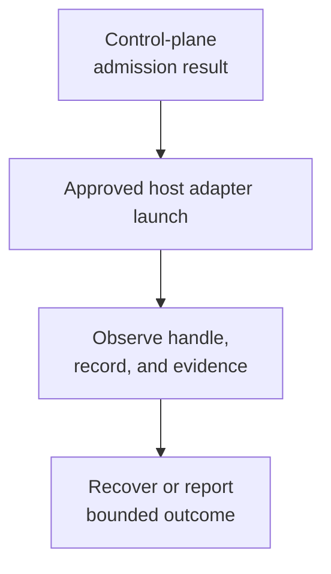

# Spawning Subagents - as-is

## Purpose

Launch, observe, recover, and hand off bounded delegated work under existing authority without making the launcher a task-record or completion authority.

## Design

The skill consumes the control plane's `admitLaunch()` result and invokes only the approved host adapter with the admitted role, task, record, caller linkage, and handoff budget. It describes the launch and observation procedure; deterministic admission and limit enforcement remain runtime/control-plane responsibilities.

**Lineage**: [as-is](../../../as-is.md#design) / [Skills](../../as-is.md#design) / [Master skills](../as-is.md#design) / **Spawning Subagents**

### Bounded launch flow

| Concern | Rule |
| --- | --- |
| Admission | Consume the admitted role, task, record, caller linkage, handoff budget, and normalized wall-clock value. |
| Forwarding | Forward the approved value exactly as `--budget-wall-clock-seconds <admitLaunch().wallClockSeconds>` to `spawn-pi-subagent.ts`. |
| Scope | Verify role, configured worker, component boundary, task state, capability, and budget before launch. |
| Observation | Observe bounded handles, task records, and source-labelled evidence; do not infer completion from exit, telemetry, or handles. |
| Recovery | Preserve cumulative budgets and recover with a new attempt or stop on failure, unavailability, staleness, or cancellation. |
| Launcher boundary | The generic launcher does not parse task records; the skill grants no tools or authority and does not itself enforce runtime limits. |

## Links

- [SKILL.md](SKILL.md) — authoritative bounded launch procedure.
- [../../as-is.md](../../as-is.md#design) — concise capability catalog entry.
- [../../../agents/component-builder/as-is.md#design](../../../agents/component-builder/as-is.md#design) — receiving role ownership.
