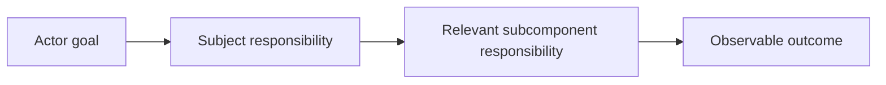

# Mermaid Diagram Design

## Purpose
Design bounded Mermaid diagrams that make a component's purpose, immediate
subcomponents, responsibilities, relationships, interactions, boundaries,
consequential flows, and observable outcomes understandable to readers without
implementation knowledge.

## Design

The skill selects a Mermaid representation based on the reader's question and
keeps authoritative context in prose.

## Boundary

The skill owns reusable diagram design and validation guidance. The owning
component record owns the meaning and authority of its purpose, boundaries,
and relationships. This skill does not own component behavior, task authority,
agent selection, context resolution, or architectural decisions.

## Links

- [SKILL.md](SKILL.md) — authoritative procedure and Mermaid type-selection guidance.
- [../managing-as-is-document/as-is.md](../managing-as-is-document/as-is.md) — durable record and diagram placement guidance.
- [../as-is.md](../as-is.md) — skills component map.
