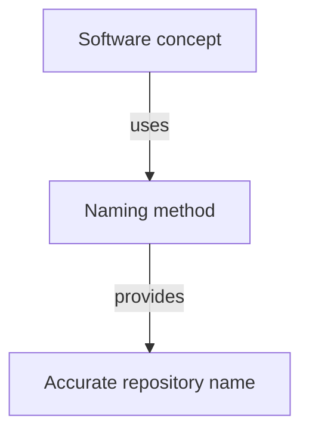

# Naming Software Concepts - as-is

## Purpose

Choose names for repository concepts that accurately communicate their role,
scope, responsibility, and lifecycle.

## Design

This is a leaf skill component; no independently documented child components
are currently defined. The reusable procedure covers skills, agents, files,
directories, APIs, configuration, and domain concepts while preserving
host-required names such as `AGENTS.md` and `SKILL.md`. It selects names after
structuring decisions have established the containing group and entry point.

**Lineage**: [as-is](../../as-is.md#design) / [Skills](../as-is.md#design) / **Naming Software Concepts**

### Concept naming method

## Links

- [SKILL.md](SKILL.md) — naming method, repository grammar, and quality checks.
- [Design Principles](../../design-principles.md) — project-wide naming and
  minimal-change principles.
