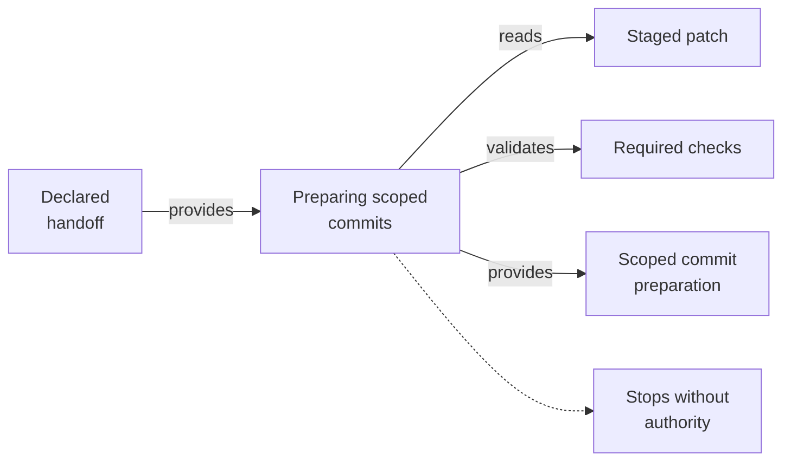

# Preparing Scoped Commits - as-is

## Purpose
Prepare authorized validated changes without staging unrelated work.

## Design
The skill separates the declared handoff, stages only the changelog, exact backlog cleanup, task cleanup, and handoff artifacts, inspects the staged patch, runs required checks, and commits once with repository message style. It composes with sibling skills that validate the changes, locate the owning changelog, and draft the history entry, and it hands prepared work to the committing procedure; it fits tasks with a declared handoff. The final clause is a terminal stop-for-direction step: when scope or completion authority is missing, it stops and requests direction instead of proceeding. It grants no tools and holds no authority beyond preparing the declared handoff for commit.

**Lineage**: [as-is](../../as-is.md#design) / [Skills](../as-is.md#design) / **Preparing Scoped Commits**

### Scoped commit preparation flow

## Links
- [SKILL.md](SKILL.md) — authoritative procedure and contract.
- [../as-is.md](../../as-is.md) — concise capability catalog entry.