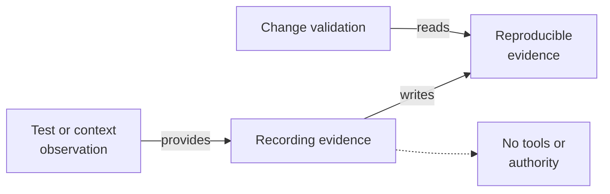

# Recording Evidence - as-is

## Purpose
Preserve observations, provenance, assumptions, and validation results as reproducible evidence.

## Design

The skill records the selector, source, timestamp or revision, command or observation, result, interpretation, and limitation for each item of evidence, keeping secrets and unbounded payloads out and linking each record to the authorized requirement.

It is a reusable sibling under the skills catalog: observations returned by running-tests and context assembled by building-context are commonly captured through it, and validating-changes consumes recorded evidence when mapping acceptance conditions.

It establishes fit for capturing reproducible evidence and grants no tools, permissions, or authority; evidence itself carries no decision authority beyond the authorized requirement it supports.

**Lineage**: [as-is](../../as-is.md#design) / [Skills](../as-is.md#design) / **Recording Evidence**

### Evidence recording flow

## Links
- [SKILL.md](SKILL.md) — authoritative procedure and contract.
- [../as-is.md](../../as-is.md) — concise capability catalog entry.