# Reusable skills - as-is

## Purpose

Organize the adopted reusable skills that provide focused capabilities to master skills and workflows.

## Components

| Component | Purpose |
| --- | --- |
| [Applying bounded edits](applying-bounded-edits/as-is.md#design) | Make small, precise edits within a bounded scope. |
| [Assessing determinism](assessing-determinism/as-is.md#design) | Identify evidence-supported deterministic improvements. |
| [Building context](building-context/as-is.md#design) | Assemble bounded, provenance-bearing context. |
| [Choosing change methods](choosing-change-methods/as-is.md#design) | Select the smallest change method that satisfies the need. |
| [Choosing names](choosing-names/as-is.md#design) | Choose semantically accurate names for repository concepts. |
| [Delegating bounded work](delegating-bounded-work/as-is.md#design) | Delegate bounded tasks under existing authority. |
| [Designing diagrams](designing-diagrams/as-is.md#design) | Design bounded diagrams for component context. |
| [Drafting changelog entries](drafting-changelog-entries/as-is.md#design) | Draft concise changelog entries. |
| [Drafting content](drafting-content/as-is.md#design) | Draft durable repository content. |
| [Identifying owners](identifying-owners/as-is.md#design) | Identify owning components and authorities. |
| [Inspecting execution evidence](inspecting-execution-evidence/as-is.md#design) | Investigate traces and readable sessions read-only. |
| [Locating changelogs](locating-changelogs/as-is.md#design) | Locate the owning changelog for a change. |
| [Observing delegated work](observing-delegated-work/as-is.md#design) | Observe delegated work without granting execution authority. |
| [Preparing scoped commits](preparing-scoped-commits/as-is.md#design) | Prepare scoped Git commits for validated work. |
| [Presenting decisions](presenting-decisions/as-is.md#design) | Present decisions with alternatives and material effects. |
| [Recording backlog items](recording-backlog-items/as-is.md#design) | Record bounded work proposals in backlog records. |
| [Recording evidence](recording-evidence/as-is.md#design) | Record completion and validation evidence. |
| [Resolving scopes](resolving-scopes/as-is.md#design) | Resolve component scopes and boundaries for work. |
| [Running tests](running-tests/as-is.md#design) | Run the smallest relevant test automation. |
| [Structuring content](structuring-content/as-is.md#design) | Organize repository knowledge. |
| [Validating changes](validating-changes/as-is.md#design) | Validate changed behavior against acceptance conditions. |
| [Writing code](writing-code/as-is.md#design) | Create or substantially implement code from bounded requirements. |
| [Writing tests](writing-tests/as-is.md#design) | Write focused tests for bounded behavior. |

## Design

**Lineage**: [as-is](../../as-is.md#design) / [Skills](../as-is.md#design) / **Reusable skills**

```mermaid
%%{init: {"securityLevel": "loose"}}%%
flowchart LR
    subgraph Reusable["Reusable skills"]
        ApplyingBoundedEdits["<a href='./applying-bounded-edits/as-is.md#design'>Applying bounded edits</a>"]
        AssessingDeterminism["<a href='./assessing-determinism/as-is.md#design'>Assessing determinism</a>"]
        BuildingContext["<a href='./building-context/as-is.md#design'>Building context</a>"]
        ChoosingChangeMethods["<a href='./choosing-change-methods/as-is.md#design'>Choosing change methods</a>"]
        ChoosingNames["<a href='./choosing-names/as-is.md#design'>Choosing names</a>"]
        DelegatingBoundedWork["<a href='./delegating-bounded-work/as-is.md#design'>Delegating bounded work</a>"]
        DesigningDiagrams["<a href='./designing-diagrams/as-is.md#design'>Designing diagrams</a>"]
        DraftingChangelogEntries["<a href='./drafting-changelog-entries/as-is.md#design'>Drafting changelog entries</a>"]
        DraftingContent["<a href='./drafting-content/as-is.md#design'>Drafting content</a>"]
        IdentifyingOwners["<a href='./identifying-owners/as-is.md#design'>Identifying owners</a>"]
        InspectingExecutionEvidence["<a href='./inspecting-execution-evidence/as-is.md#design'>Inspecting evidence</a>"]
        LocatingChangelogs["<a href='./locating-changelogs/as-is.md#design'>Locating changelogs</a>"]
        ObservingDelegatedWork["<a href='./observing-delegated-work/as-is.md#design'>Observing delegated work</a>"]
        PreparingScopedCommits["<a href='./preparing-scoped-commits/as-is.md#design'>Preparing scoped commits</a>"]
        PresentingDecisions["<a href='./presenting-decisions/as-is.md#design'>Presenting decisions</a>"]
        RecordingBacklogItems["<a href='./recording-backlog-items/as-is.md#design'>Recording backlog items</a>"]
        RecordingEvidence["<a href='./recording-evidence/as-is.md#design'>Recording evidence</a>"]
        ResolvingScopes["<a href='./resolving-scopes/as-is.md#design'>Resolving scopes</a>"]
        RunningTests["<a href='./running-tests/as-is.md#design'>Running tests</a>"]
        StructuringContent["<a href='./structuring-content/as-is.md#design'>Structuring content</a>"]
        ValidatingChanges["<a href='./validating-changes/as-is.md#design'>Validating changes</a>"]
        WritingCode["<a href='./writing-code/as-is.md#design'>Writing code</a>"]
        WritingTests["<a href='./writing-tests/as-is.md#design'>Writing tests</a>"]
    end
    classDef component fill:#f8fafc,fill-opacity:0.1,stroke:#334155,stroke-width:2px
    classDef child fill:#2563eb,fill-opacity:0.1,stroke:#64748b,stroke-width:1px
    class Reusable component
    class ApplyingBoundedEdits,AssessingDeterminism,BuildingContext,ChoosingChangeMethods,ChoosingNames,DelegatingBoundedWork,DesigningDiagrams,DraftingChangelogEntries,DraftingContent,IdentifyingOwners,InspectingExecutionEvidence,LocatingChangelogs,ObservingDelegatedWork,PreparingScopedCommits,PresentingDecisions,RecordingBacklogItems,RecordingEvidence,ResolvingScopes,RunningTests,StructuringContent,ValidatingChanges,WritingCode,WritingTests child
```

## Links

- [../as-is.md](../as-is.md) — Skills namespace record and adopted catalog.
- [../../design-principles.md](../../design-principles.md) — repository-wide authority and design principles.
