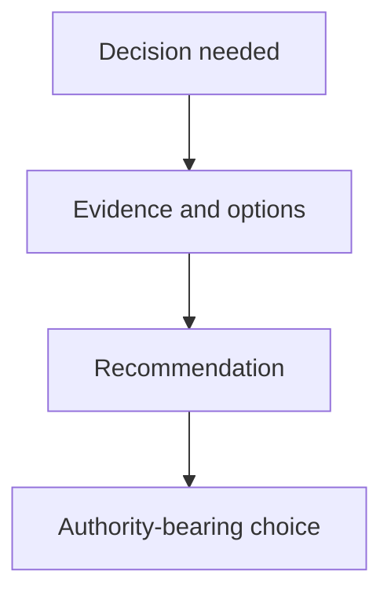

# Presenting Decisions - as-is

## Purpose
Present bounded decisions, alternatives, uncertainty, and recommendations to an authority-bearing decider.

## Design

The skill sequences a bounded decision presentation: state the decision needed, present evidence with options and trade-offs, recommend only when justified, and stop without treating advice as approval.

It is a reusable sibling under the skills catalog alongside procedures such as building-context and validating-changes, which can supply the evidence and acceptance context a presented decision relies on, and it hands the explicit choice to a named authority-bearing decider.

It establishes fit only and grants no tools, no task authority, and no permission to proceed; the decider alone holds the authority-bearing choice.

**Lineage**: [as-is](../../../as-is.md#design) / [Skills](../../as-is.md#design) / **Presenting Decisions**

### Decision presentation flow

## Links
- [SKILL.md](SKILL.md) — authoritative procedure and contract.
- [../../as-is.md](../../as-is.md) — concise capability catalog entry.