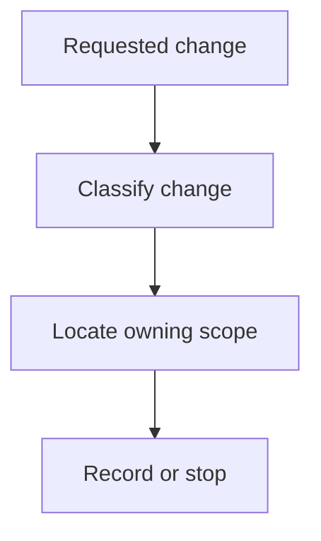

# Resolving Scopes - as-is

## Purpose
Resolve component, artifact, project, or root scopes for a requested change without assuming a component task.

## Design

The skill classifies the requested change and changed artifact, inspects component records and ownership contracts, tests component-task applicability, chooses the smallest owning scope, records the decision, and stops for explicit direction when ownership or applicability is ambiguous.

It is a reusable sibling under the skills catalog; its scope resolution feeds downstream procedures such as implementing-component-tasks and making-changes, and its ownership inspection relies on component as-is records for authoritative boundary context.

It establishes fit only and grants no tools or authority; it must not assume a component task or override an owning component's authority when ownership is ambiguous.

**Lineage**: [as-is](../../as-is.md#design) / [Skills](../as-is.md#design) / **Resolving Scopes**

### Scope resolution flow

## Links
- [SKILL.md](SKILL.md) — authoritative procedure and contract.
- [../as-is.md](../as-is.md) — concise capability catalog entry.