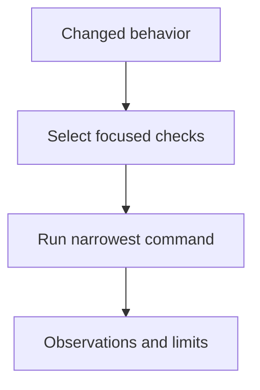

# Running Tests - as-is

## Purpose
Run the smallest relevant test or check for a changed behavior and return observations.

## Design

The skill maps changed artifacts to the narrowest applicable existing checks, executes them without broadening scope, and captures pass, failure, skip, timeout, and environment status without reinterpreting process exit as completion.

It is a reusable sibling under the skills catalog: validating-changes consumes its observations when mapping acceptance conditions, and recording-evidence preserves its observations when they must survive as reproducible evidence.

It establishes fit only and grants no tools or authority; it reports results and limitations and recommends the next bounded check rather than declaring completion when evidence is insufficient.

**Lineage**: [as-is](../../../as-is.md#design) / [Skills](../../as-is.md#design) / **Running Tests**

### Check selection and run flow

## Links
- [SKILL.md](SKILL.md) — authoritative procedure and contract.
- [../../as-is.md](../../as-is.md) — concise capability catalog entry.