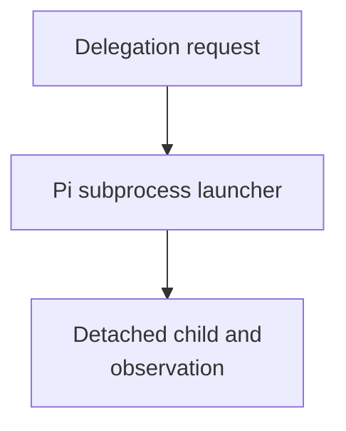

# Launcher Host-Config Resolution And Run Observability - as-is

## Purpose

The `spawning-pi-subagents` launcher is the repository's bridge between an agent
file and a Pi child process. Agent contracts own ordinary capability
declarations; this package owns admission, validation, and forwarding of those
declarations, while the Pi host/package owns tool implementations. Shared
agent front-matter parsing, canonical role lookup, declared-tool parsing, and
identity extraction are provided by the focused `agent-resolution.ts`
functionality consumed by both the launcher and in-process worker adapter. No
launcher branch may silently inject ordinary tools because of role identity.
Unsupported or unavailable declarations fail closed, with stricter read-only
safety profiles remaining explicit host caps. The focused agent-resolution behavior is covered by `scripts/agent-resolution.test.ts` and the launcher/worker behavioral suites.

### Parent integration ownership

The receiving `component-builder` owns semantic child-result review and
nearest-common-ancestor integration. This launcher performs only mechanical
handoff, durable evidence collection, and caller-HEAD ancestry observation; it
never merges, cherry-picks, resolves conflicts, or decides integration.

An isolated child commit is `pending-parent-integration` until the receiving
builder integrates it and ancestry proves it reachable from caller `HEAD`.
Parent-owned worktree changes, same-component in-process assistance, and
no-change work have no separate child merge; the parent must record an explicit
`no-separate-integration` disposition and still satisfy validation, descendant
closure, and scoped-commit gates.

Both subprocess and in-process delegation resolve the target agent's `model:`
and `thinking:` values through project configuration, so a child can name a
model preset and thinking level without inheriting caller-session settings or
relying on environment variables. The subprocess launcher passes the resolved
values explicitly to Pi; the in-process adapter resolves the corresponding
configured Pi model before creating its isolated session. The launcher fallback
uses the skill-owned compatible Pi package version and child runs remain
observable by default.

## Design

The component is organized around the following relationships and flow.

**Lineage**: [as-is](../../as-is.md#design) / [Skills](../as-is.md#design) / **Launcher Host-Config Resolution And Run Observability**

### Delegation launch and observation flow

| Concern | Rule |
| --- | --- |
| Admission | Any agent declaring `call_subagent` may target any canonical role under `agents/<role>/agent.md`. |
| Diagnostic metadata | Caller name, parent job ID, target identity, and runtime lineage are diagnostic only, not authorization gates. |
| Target behavior | The target contract and host safety profile govern tools and behavior. |
| Execution authority | Task records, budgets, worktree/session boundaries, and completion gates remain authoritative for execution and handoff. |
| In-process adapter | The Pi extension resolves canonical targets independently of caller identity. |
| Expert profile | The expert target retains its fixed read-only inspection profile.
## Links

- [SKILL.md](SKILL.md) — authoritative procedure and contract.
- [scripts/agent-resolution.ts](scripts/agent-resolution.ts) — shared canonical role, front-matter, declared-tool, and identity resolution functionality.
- [scripts/spawn-pi-subagent.ts](scripts/spawn-pi-subagent.ts) — subprocess launcher and detached supervisor adapter.
- [scripts/bounded-process-supervisor.ts](scripts/bounded-process-supervisor.ts) — shared mechanical process-group, timer, signal, stdio, and exit-observation boundary.
