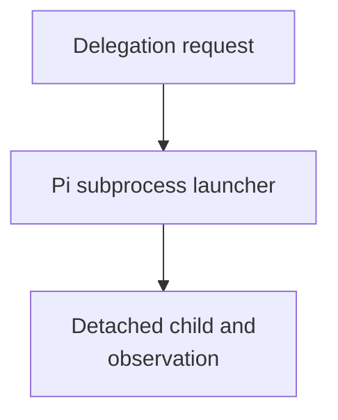

# Launcher Host-Config Resolution And Run Observability - as-is

## Purpose

The `spawning-pi-subagents` launcher is the repository's bridge between an agent
file and a Pi child process. Agent contracts own ordinary capability
declarations; this package owns admission, validation, and forwarding of those
declarations, while the Pi host/package owns tool implementations. Shared
agent front-matter parsing, canonical role lookup, declared-tool parsing, and
identity extraction are provided by the focused `agent-resolution.ts`
functionality consumed by both the launcher and in-process worker adapter. No
launcher branch may silently inject ordinary tools because of role identity.
Unsupported or unavailable declarations fail closed, with stricter read-only
safety profiles remaining explicit host caps. The focused agent-resolution behavior is covered by `scripts/agent-resolution.test.ts` and the launcher/worker behavioral suites.

### Parent integration ownership

The receiving `component-builder` owns semantic child-result review and
nearest-common-ancestor integration. This launcher performs only mechanical
handoff, durable evidence collection, and caller-HEAD ancestry observation; it
never merges, cherry-picks, resolves conflicts, or decides integration.

An isolated child commit is `pending-parent-integration` until the receiving
builder integrates it and ancestry proves it reachable from caller `HEAD`.
Parent-owned worktree changes, same-component in-process assistance, and
no-change work have no separate child merge; the parent must record an explicit
`no-separate-integration` disposition and still satisfy validation, descendant
closure, and scoped-commit gates.

Both subprocess and in-process delegation resolve the target agent's `model:`
and `thinking:` values through project configuration, so a child can name a
model preset and thinking level without inheriting caller-session settings or
relying on environment variables. The subprocess launcher passes the resolved
values explicitly to Pi; the in-process adapter resolves the corresponding
configured Pi model before creating its isolated session. The launcher fallback
uses the skill-owned compatible Pi package version and child runs remain
observable by default. The launcher now derives one exact Pi version from the
private package manifest and performs an extension-suppressed local version
preflight before dry-run output or child launch. The private package manifest
and lockfile own the direct Pi and TypeBox dependencies used by package scripts
and extension-facing checks; package-local build commands provide a bounded
dependency-resolution check. Repository-wide launcher fixtures retain their
repository-root execution contract because they exercise canonical agents,
skills, tools, and task records outside this component.

## Design

The component is organized around the following relationships and flow.

**Lineage**: [as-is](../../as-is.md#design) / [Skills](../as-is.md#design) / **Launcher Host-Config Resolution And Run Observability**

### Delegation launch and observation flow

| Concern | Rule |
| --- | --- |
| Admission | Any agent declaring `call_subagent` may target any canonical role under `agents/<role>/agent.md`. |
| Diagnostic metadata | Caller name, parent job ID, target identity, and runtime lineage are diagnostic only, not authorization gates. |
| Target behavior | The target contract and host safety profile govern tools and behavior. |
| Execution authority | Task records, budgets, worktree/session boundaries, and completion gates remain authoritative for execution and handoff. |
| In-process adapter | The Pi extension resolves canonical targets independently of caller identity. |
| Expert profile | The expert target retains its fixed read-only inspection profile.
## Links

- [SKILL.md](SKILL.md) — authoritative procedure and contract.
- [../../core/modules/agent-resolution/agent-resolution.ts](../../core/modules/agent-resolution/agent-resolution.ts) — shared canonical role, front-matter, declared-tool, and identity resolution functionality.
- [scripts/spawn-pi-subagent.ts](scripts/spawn-pi-subagent.ts) — subprocess launcher and detached supervisor adapter; it collects handoff observations but delegates pure eligibility to task control.
- [`../../core/modules/task-control/handoff-eligibility.ts`](../../core/modules/task-control/handoff-eligibility.ts) — pure task-control handoff decision consumed by the launcher.
- [`../../core/modules/context-resolution/configuration-resolver.ts`](../../core/modules/context-resolution/configuration-resolver.ts) — shared configuration-resolution functionality consumed by launcher and worker configuration adapters.
- [../../core/adapters/process/bounded-process-supervisor.ts](../../core/adapters/process/bounded-process-supervisor.ts) — shared mechanical process-group, timer, signal, stdio, and exit-observation boundary.
- [../../tools/evidence/worker-tools-observability.ts](../../tools/evidence/worker-tools-observability.ts) — focused bounded session and trace query functionality consumed by the Pi registration adapter.
- [../../tools/agent/subagent-tools.ts](../../tools/agent/subagent-tools.ts) — bounded agent-tool implementation and delegation adapter composition that retains role admission and call-subagent authority.
- [package.json](package.json) — private package manifest owning direct Pi and TypeBox dependencies plus bounded package-local build commands.
- [bun.lock](bun.lock) — committed package dependency resolution and integrity evidence.
- [scripts/pi-version.ts](scripts/pi-version.ts) — manifest-derived exact version contract, bounded output parser, and probe-argument policy.
- [as-is.json](as-is.json) and [tasks.md](tasks.md) — active readiness task authority and human evidence for the package-owned extension boundary; these are transient until completion.

### Package-owned extension readiness

The package-owned subagent extension remains a future implementation boundary. The current semantic worker-tool implementation stays in `tools/agent/subagent-tools.ts`, while `.pi/extensions/worker-tools.ts` remains the host registration adapter and the launcher continues to load the repository implementation explicitly under `--no-extensions`. A package move is not authorized by this record alone.

The implementation prerequisite is a versioned host-services contract owned by a neutral host/core boundary. The future package entry may own Pi-facing schemas and registration, bounded call mechanics, and configured-tool exposure, but repository authority remains outside the package:

- canonical role and declared-tool resolution remains in `core/modules/agent-resolution`;
- model, provider, and thinking configuration remains in repository configuration resolution;
- component-context authority remains with the linked-context resolver and its tool boundary;
- task budget observation remains outside the package and never becomes a second task authority;
- trace persistence and session/evidence scope remain with observability and evidence owners.

The package entry must receive these services through an explicit, versioned API or a repository-owned adapter with a documented loading route. Hidden repository-relative imports and environment-selected dynamic imports are not acceptable installed-package boundaries. The contract must choose whether the distribution unit is repository-local or distributable; Pi-provided imports and `typebox` must follow the selected Pi peer/dependency rules without weakening the launcher’s exact `0.84.0` contract.

The supported future loading plan is a package manifest with a `pi.extensions` entry, local package registration only after trust and no-duplicate behavior are proven, and continued explicit launcher loading under `--no-extensions`. The existing `.pi/extensions/worker-tools.ts` remains until package registration, launcher loading, tool-admission, and duplicate-registration checks pass; it must not evolve into a second semantic implementation. Mermaid remains independently registered, and `evidence-validator-inspection-extension.ts` remains a separate fixed read-only launcher profile. The implementation task must add package-isolation, registration, launcher, trust, Mermaid, evidence-validator, and existing worker/observability regression checks, with rollback to the current adapter if package loading fails.
