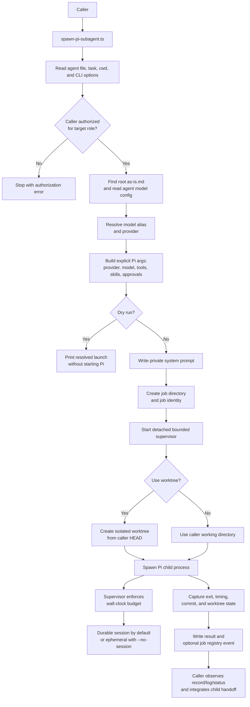
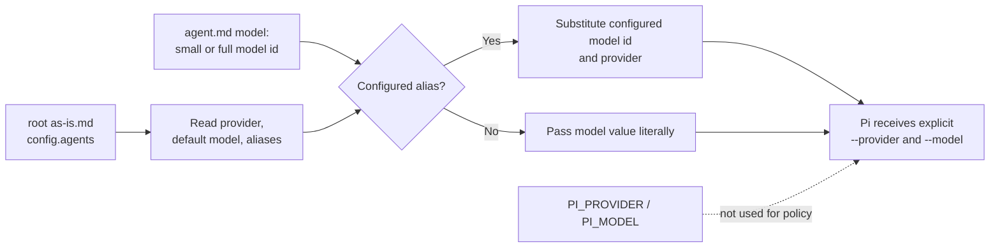
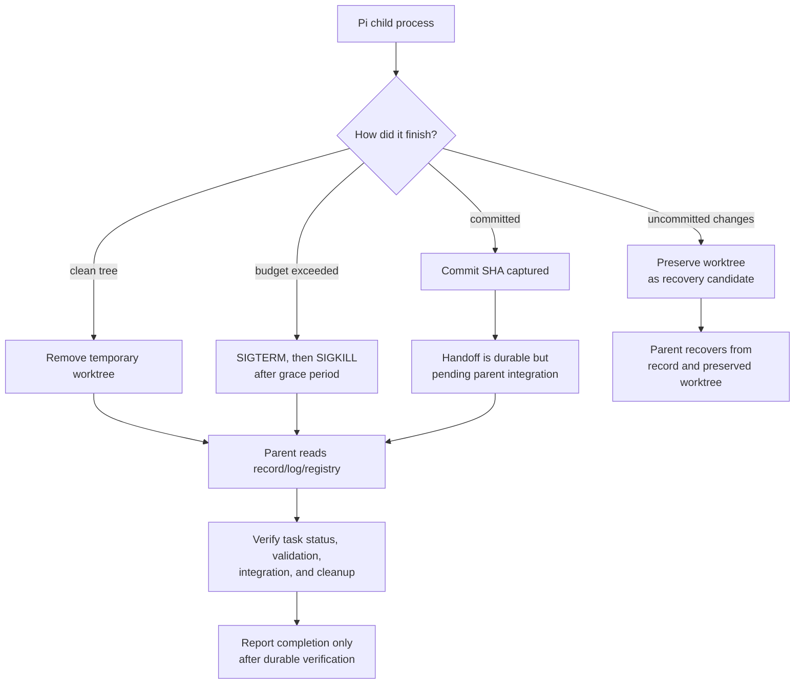

# Launcher Host-Config Resolution And Run Observability

## Delegation Design

Delegation is capability-based and intentionally no-holds-barred: any agent
that declares the `call_subagent` capability may target any canonical agent
role under `agents/<role>/agent.md`. Caller name, parent job ID, target
identity, and runtime lineage are diagnostic metadata only; they are not
authorization gates. The target contract and host safety profile still govern
the target's tools and behavior, while task records, budgets, worktree/session
boundaries, and completion gates remain authoritative for execution and
handoff. The in-process Pi extension is an explicit host implementation
consumer of this design; it resolves canonical targets independently of caller
identity. The expert target retains its fixed read-only inspection profile.

## Purpose

The `spawning-pi-subagents` launcher is the repository's bridge between an agent
file and a Pi child process. It currently passes the agent's `model:` value
literally to pi and relies on inherited `PI_PROVIDER`/`PI_MODEL` environment
variables for the provider, so an agent cannot name a fast model by alias and
the launch path is not portable to a host without those env vars set. This task
makes the launcher resolve model presets and the provider from the repository's
root `as-is.md` and makes child runs observable by default.

## Design

### Launch flow

### Model and execution configuration

### Worktree, handoff, and recovery flow

**Key:** the launcher starts and observes bounded Pi work, but it does not
 decide whether the task itself is semantically complete. The component task
 record and parent integration remain authoritative; process exit, logs,
 sessions, JobIds, and registry entries are supporting evidence.

## Requirement

Implement model-alias resolution and config-driven provider selection in
`skills/spawning-pi-subagents/scripts/spawn-pi-subagent.ts`, plus durable-session
observability. An agent file's `model:` (or a `--model` override) that names a
configured preset must resolve to its model value from root `as-is.md`; a non-preset value passes through literally. The child
must receive `--provider` and `--model` explicitly so it does not depend on
`PI_PROVIDER`/`PI_MODEL` env vars.

## Plan

1. Add a small config reader that reads the root `as-is.md` from `cwd` (searching
   upward) and returns `config.agents.defaultModel`, `provider`, and the named
   `models` map. Tolerate a missing/unreadable record (fall back to passing the
   model value literally with no provider).
2. Resolve the model value (`options.model ?? definition.model`): if it matches
   an alias key in any provider's `models` map, substitute that `id` and
   remember the provider; otherwise keep the value literal. Never error on an
   unknown value.
3. Build the child args with `--provider 
` (the resolving provider, or the
   single configured provider for a literal value) and `--model <resolved>`
   whenever a model is set; do not require `PI_PROVIDER`/`PI_MODEL` to be set in
   the environment for the child to run.
4. Replace the hardcoded `--no-session` with a durable session by default
   (e.g. `--session-dir` under the job directory or `--session`), and add a
   `--no-session` flag that opts out to ephemeral mode; surface the session
   path in the handle/result so a caller can inspect turns and latency.
5. Reflect the resolved model, provider, and session path in `--dry-run` and the
   `Handle`/result shape; update SKILL.md to document alias resolution,
   config-driven provider, and session observability.
6. Keep all other launcher behavior unchanged.

## Progress

Implemented in commit `2a40de0`: model preset resolution, explicit provider/model arguments, durable session-directory default with `--no-session` opt-out, and session/provider observability in dry-run and handles. This task is the
enabler for the as-is agent's `model: small` pin (see
`agents/as-is/as-is.md`). The `.agents/agents` tree is reserved for client host projection semantics.

## Validation

- `--dry-run` shows `model` resolved from the root `small` preset and an
  explicit provider field.
- A non-alias model value passes through literally without error.
- A child launch runs with `PI_PROVIDER` and `PI_MODEL` unset in the inherited
  environment (provider+model come from config/agent file).
- A real run writes a session file by default; `--no-session` opts out.
- `bun build` and the launcher test suite pass; `opencode agent list` still
  discovers the agents; `git diff --check` is clean.

## Result

Completed. Validation evidence: Bun build succeeded; dry-run resolved the root `small` preset with explicit provider/model args; unknown literal model values pass through; and `git diff --check` was clean.

## Blockers And Escalations

None. The launcher reads root `as-is.md` as plain authored configuration and
must not couple to OpenCode runtime configuration. If the record is absent, the
launcher still launches with a literal model and no provider. If Pi rejects an
explicit `--provider` on some host, record the host fallback while retaining
model resolution.

## Links

- `SKILL.md` — authoritative procedure and contract.
- `backlog.md` — planning index for this component's open work.

## Recovery

Recover from this record, the launcher at
`skills/spawning-pi-subagents/scripts/spawn-pi-subagent.ts`, and Git history. If
the worker return is interrupted, reread this record before resuming; do not
re-create `task-archives/`.

## Changelog

- 2026-08-08: Added explicit normal-session loading of the project-local
  `.pi/extensions/worker-tools.ts`, disabled duplicate extension discovery, and
  forwarded `call_subagent` in normal component-builder tool profiles. Bounded
  in-process expert `git_inspect` access remains expert-only; subprocess expert
  validation retains its separate restricted inspection profile. Focused
  launcher tests (18), Bun build, diff-check, and a fresh in-process expert
  final gate passed. Residual risk: live provider execution and caller
  ancestry integration are outside this component's focused prerequisite
  evidence.
- Kept the launcher/worktree/observation follow-ups here after ownership
  review.
- Moved cumulative-accounting follow-up ownership to
  `designs/as-is.md` and `designs/execution-accounting-design.md`.
- Historical investigation found that synchronous nested delegation, repeated
  recovery, blind waiting, and missing supervisor-owned enforcement caused
  excessive elapsed time; retain this as rationale only, not as a current
  handoff or runtime log.

## Next Action

Select the package-owned dependency and Pi-version-alignment backlog items before
adding project-level dependencies. Pi-specific sub-agent tools belong in the
owning skill package, not under agent directories; agent files remain role
contracts and capability declarations.
