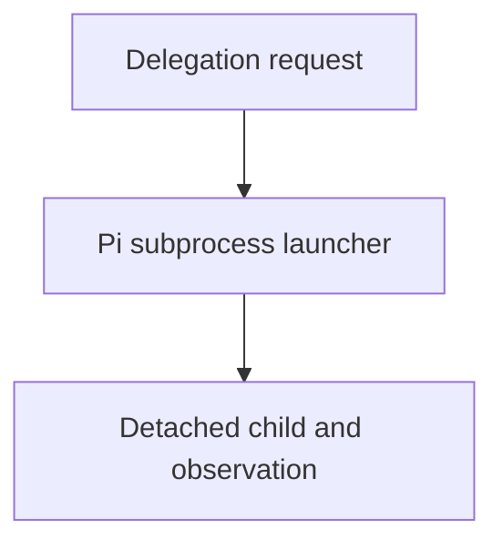

# Launcher Host-Config Resolution And Run Observability

## Delegation Design

Delegation is capability-based and intentionally no-holds-barred: any agent
that declares the `call_subagent` capability may target any canonical agent
role under `agents/<role>/agent.md`. Caller name, parent job ID, target
identity, and runtime lineage are diagnostic metadata only; they are not
authorization gates. The target contract and host safety profile still govern
the target's tools and behavior, while task records, budgets, worktree/session
boundaries, and completion gates remain authoritative for execution and
handoff. The in-process Pi extension is an explicit host implementation
consumer of this design; it resolves canonical targets independently of caller
identity. The expert target retains its fixed read-only inspection profile.

## Purpose

The `spawning-pi-subagents` launcher is the repository's bridge between an agent
file and a Pi child process. It currently passes the agent's `model:` value
literally to pi and relies on inherited `PI_PROVIDER`/`PI_MODEL` environment
variables for the provider, so an agent cannot name a fast model by alias and
the launch path is not portable to a host without those env vars set. This task
makes the launcher resolve model presets and the provider from the repository's
root `as-is.md` and makes child runs observable by default.

## Diagram

## Links

- `SKILL.md` — authoritative procedure and contract.
- `backlog.md` — planning index for this component's open work.

## Changelog

- 2026-08-08: Added explicit normal-session loading of the project-local
  `.pi/extensions/worker-tools.ts`, disabled duplicate extension discovery, and
  forwarded `call_subagent` in normal component-builder tool profiles. Bounded
  in-process expert `git_inspect` access remains expert-only; subprocess expert
  validation retains its separate restricted inspection profile. Focused
  launcher tests (18), Bun build, diff-check, and a fresh in-process expert
  final gate passed. Residual risk: live provider execution and caller
  ancestry integration are outside this component's focused prerequisite
  evidence.
- Kept the launcher/worktree/observation follow-ups here after ownership
  review.
- Moved cumulative-accounting follow-up ownership to
  `designs/as-is.md` and `designs/execution-accounting-design.md`.
- Historical investigation found that synchronous nested delegation, repeated
  recovery, blind waiting, and missing supervisor-owned enforcement caused
  excessive elapsed time; retain this as rationale only, not as a current
  handoff or runtime log.
