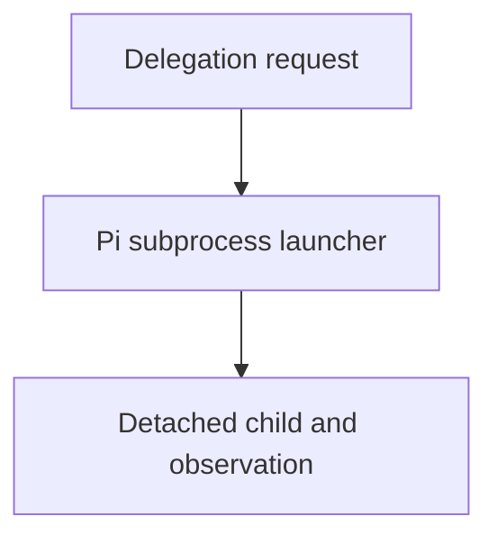

# Launcher Host-Config Resolution And Run Observability - as-is

## Delegation Design

Delegation is capability-based and intentionally no-holds-barred: any agent
that declares the `call_subagent` capability may target any canonical agent
role under `agents/<role>/agent.md`. Caller name, parent job ID, target
identity, and runtime lineage are diagnostic metadata only; they are not
authorization gates. The target contract and host safety profile still govern
the target's tools and behavior, while task records, budgets, worktree/session
boundaries, and completion gates remain authoritative for execution and
handoff. The in-process Pi extension is an explicit host implementation
consumer of this design; it resolves canonical targets independently of caller
identity. The expert target retains its fixed read-only inspection profile.

## Purpose

The `spawning-pi-subagents` launcher is the repository's bridge between an agent
file and a Pi child process. Agent contracts own ordinary capability
declarations; this package owns admission, validation, and forwarding of those
declarations, while the Pi host/package owns tool implementations. No launcher
branch may silently inject ordinary tools because of role identity. Unsupported
or unavailable declarations fail closed, with stricter read-only safety
profiles remaining explicit host caps.

### Parent integration ownership

The receiving `component-builder` owns semantic child-result review and
nearest-common-ancestor integration. This launcher performs only mechanical
handoff, durable evidence collection, and caller-HEAD ancestry observation; it
never merges, cherry-picks, resolves conflicts, or decides integration.

An isolated child commit is `pending-parent-integration` until the receiving
builder integrates it and ancestry proves it reachable from caller `HEAD`.
Parent-owned worktree changes, same-component in-process assistance, and
no-change work have no separate child merge; the parent must record an explicit
`no-separate-integration` disposition and still satisfy validation, descendant
closure, and scoped-commit gates.

Both subprocess and in-process delegation resolve the target agent's `model:`
and `thinking:` values through project configuration, so a child can name a
model preset and thinking level without inheriting caller-session settings or
relying on environment variables. The subprocess launcher passes the resolved
values explicitly to Pi; the in-process adapter resolves the corresponding
configured Pi model before creating its isolated session. The launcher fallback
uses the skill-owned compatible Pi package version and child runs remain
observable by default.

## Design

The component is organized around the following relationships and flow.

[as-is](../../as-is.md#design) / [Skills](../as-is.md#design) / **Launcher Host-Config Resolution And Run Observability**

- Pre-render layout plan: use the repository Markdown render surface without assuming fixed dimensions; arrange three visible nodes and two directed edges as a compact top-to-bottom TB/ELK-style delegation flow from request through launcher to detached child observation. Keep one ungrouped linear route with short labels; renderer geometry and ELK support remain untested.

### Delegation launch and observation flow

## Links

- [SKILL.md](SKILL.md) — authoritative procedure and contract.
