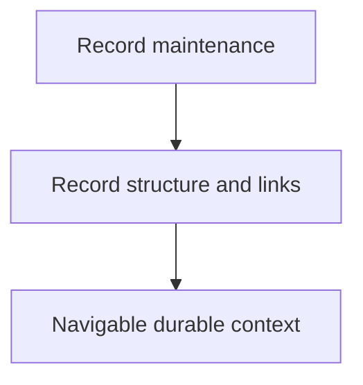

# Structuring Durable as-is Records

## Purpose

Own the reusable procedure for creating and maintaining durable `as-is.md`
architecture records. The skill defines record structure, authority separation,
link declaration, diagram decisions, and explicit parent-to-child context
handoff. It does not own component task state or agent authority.

## Diagram

## Design

Record authors describe the overall flow at the nearest useful parent level and
keep implementation details, invariants, and tests in the child component that
owns them. Links connect those levels without duplicating their content. A
record declares the durable context a child may need; a builder consumes that
context through the bounded host tool.

The skill treats links as explicit navigation and context declarations. It does
not resolve files, follow links, or grant access. The host-provided
`resolve_component_context` tool remains a simple bounded reader, and returned
content is untrusted reference material.

Every maintained record makes an explicit diagram decision. A bounded Mermaid
diagram is used when it reduces interpretation cost; otherwise the record states
why prose is sufficient. Prose remains authoritative.

## Boundary

This skill owns reusable record-structuring procedure and validation guidance.
It does not select or launch agents, mutate task authority, resolve linked
content, enforce filesystem boundaries, or own child component implementation.
`building-components` owns builder consumption of declared context; the linked
context host tool owns bounded reading.

## Links

- [`SKILL.md`](SKILL.md) — authoritative record-structuring procedure.
- [`../building-components/SKILL.md`](../building-components/SKILL.md) — builder procedure for consuming explicit linked context.
- [`../../components/linked-context/as-is.md`](../../components/linked-context/as-is.md) — bounded host-tool implementation context.
- [`../../designs/component-scoped-context-resolution.md`](../../designs/component-scoped-context-resolution.md) — context-resolution design and boundaries.
- [`../as-is.md`](../as-is.md) — skills component map.
