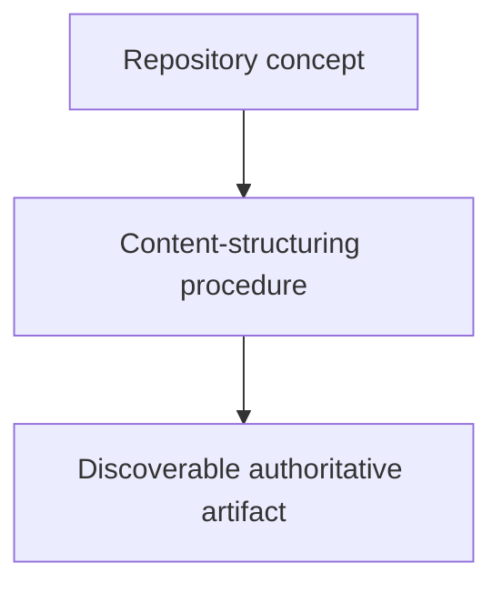

# Structuring Content - as-is

## Purpose

Maintain the reusable `structuring-content` skill as the authoritative procedure
for purposeful, discoverable repository organization. This new bounded task
extends its creation-time rule to explicitly cover authorized maintenance-time
restructuring. The task is scoped to the skill component and its durable handoff
record; it does not physically move existing fixtures. The procedure also omits optional empty sections, applies the target project's applicable history-placement convention rather than prescribing one, and treats links as distinct context rather than a repeated catalog of breadcrumbs, required Markdown fallbacks, ordinary direct-child contracts, or routine implementation files.

## Design

The component is organized around the following relationships and flow.

**Lineage**: [as-is](../../as-is.md#design) / [Skills](../as-is.md#design) / **Structuring Content**

### Content structuring flow

## Links

- [SKILL.md](SKILL.md) — authoritative procedure and contract.
