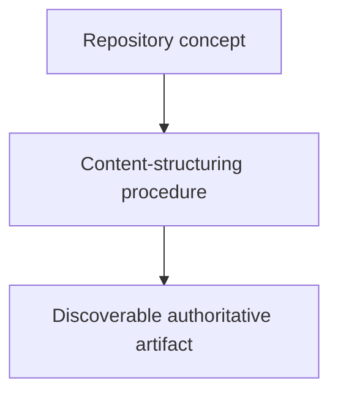

# Structuring Content - as-is

## Purpose

Maintain the reusable `structuring-content` skill as the authoritative procedure
for purposeful, discoverable repository organization. This new bounded task
extends its creation-time rule to explicitly cover authorized maintenance-time
restructuring. The task is scoped to the skill component and its durable handoff
record; it does not physically move existing fixtures. The procedure also omits optional empty sections and treats links as distinct context rather than a repeated catalog of nearby navigation or routine implementation files.

## Design

The component is organized around the following relationships and flow.

Parent: [Skills](../as-is.md#design)

## Links

- [SKILL.md](SKILL.md) — authoritative procedure and contract.

## Changelog

- This record already carries the reusable maintenance-time restructuring rule;
  no additional move was required.
