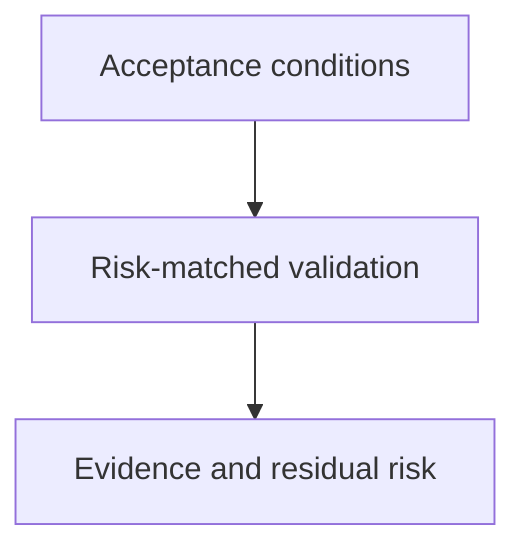

# Verification Discipline

## Purpose

Provide a reusable method for establishing whether a bounded task satisfies its
acceptance conditions using appropriate evidence.

## Diagram

## Links

- `changelog.md` — concise completed-task history.
