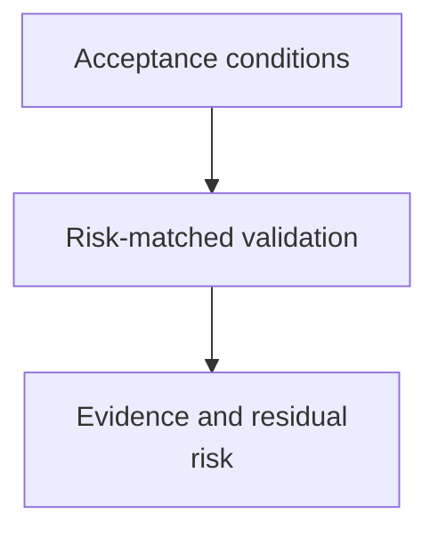

# Verification Discipline - as-is

## Purpose

Provide a reusable method for establishing whether a bounded task satisfies its
acceptance conditions using appropriate evidence.

## Design

The component is organized around the following relationships and flow.

**Lineage**: [as-is](../../as-is.md#design) / [Skills](../as-is.md#design) / **Verification Discipline**

### Acceptance-evidence flow

