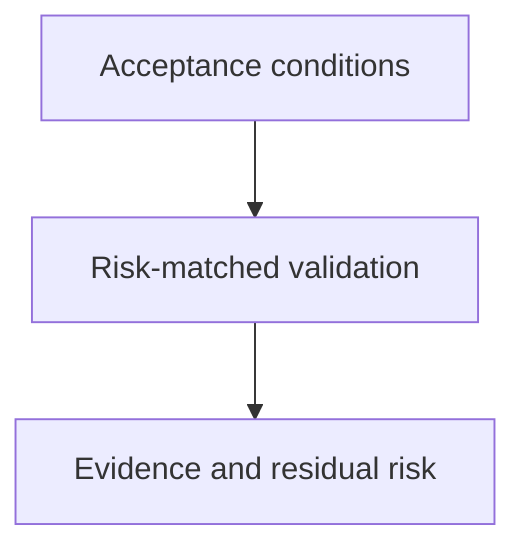

# Verification Discipline - as-is

## Purpose

Provide a reusable method for establishing whether a bounded task satisfies its
acceptance conditions using appropriate evidence.

## Design

The component is organized around the following relationships and flow.

[as-is](../../as-is.md#design) / [Skills](../as-is.md#design) / **Verification Discipline**

- Pre-render layout plan: use the repository Markdown render surface without assuming fixed dimensions; arrange three visible nodes and two directed edges as a compact top-to-bottom TB/ELK-style progression from acceptance conditions through risk-matched validation to evidence and residual risk. Keep one ungrouped linear route with short labels; renderer geometry and ELK support remain untested.

### Acceptance-evidence flow

