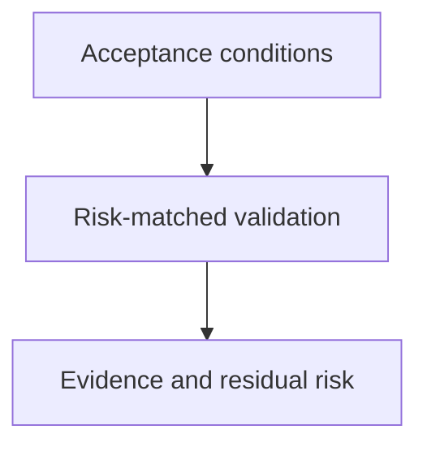

# Verification Discipline - as-is

## Purpose

Provide a reusable method for establishing whether a bounded task satisfies its
acceptance conditions using appropriate evidence.

## Design

[Open Skills design](../as-is.md#design)

The component is organized around the following relationships and flow.

Parent: [Skills](../as-is.md#design)

## Links
