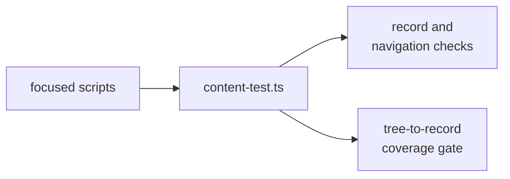

# as-is validators - as-is

## Purpose
Run repository-wide dogfood validators that check canonical as-is records, navigation, diagrams, and content invariants without becoming a task or architecture authority.

## Design

This runtime home contains `content-test.ts` and the focused validators under `scripts/`. The entry point performs the repository-wide phrase batteries, canonical-record walk, navigation checks, Mermaid source checks, and the component-boundary coverage gate; the scripts provide focused orientation and diagram validation support.

**Lineage**: [as-is](../../as-is.md#design) / [tools](../as-is.md#design) / **as-is validators**

### Repository validation

This is the F5/A4 runtime-only home retained when the narrative `managing-as-is-document` skill retired. It was re-homed before the structuring pass at commit `1f9c25e`; its repository-wide dogfood role remains under `tools/`, and the validator does not grant authority to the records it checks.

## Links

- [`content-test.ts`](content-test.ts) — repository-wide dogfood entry point.
- [`scripts/validate-as-is-diagrams-and-navigation.ts`](scripts/validate-as-is-diagrams-and-navigation.ts) — canonical record and diagram validation helper.
