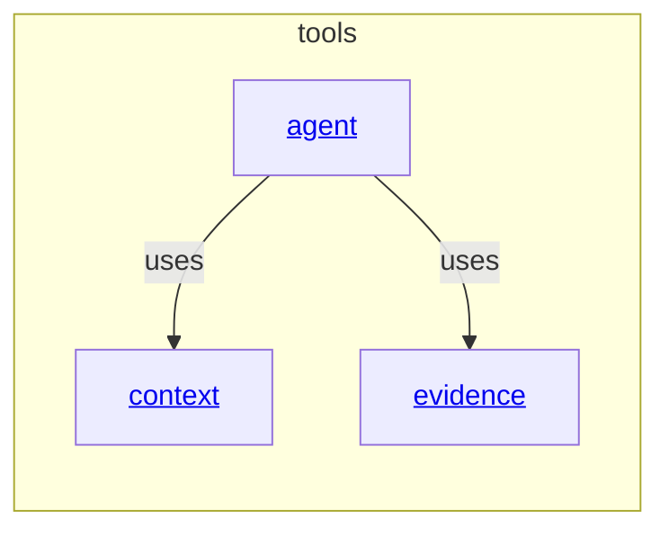

# tools - as-is

## Purpose

Organize bounded agent-facing tool implementations separately from host registration adapters, deterministic modules, and authority-bearing roles.

## Components

| Component | Purpose |
| --- | --- |
| [Agent](agent/as-is.md#design) | Expose bounded subagent assistance while preserving role admission and task authority outside the tool. |
| [Context](context/as-is.md#design) | Expose explicitly linked component context through the host-neutral resolver. |
| [Evidence](evidence/as-is.md#design) | Expose bounded session and trace evidence queries. |

## Design

**Lineage**: [as-is](../as-is.md#design) / **tools**

Tools expose bounded functionality to agents. They do not select roles, authorize task transitions, mutate task records, grant component ownership, or replace host adapters. The `.pi/extensions/` files remain thin Pi registration entry points for these implementations.

## Links

- [`../designs/core-modules-tools-and-skills.md`](../designs/core-modules-tools-and-skills.md) — target tool families and boundaries.
