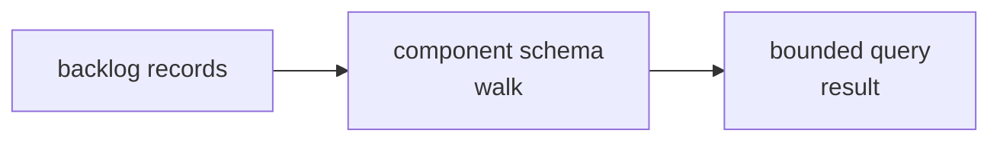

# backlog query - as-is

## Purpose
Provide bounded backlog query tooling that reads the repository's backlog records and walks their component schema without owning backlog status or task authority.

## Design

This runtime home contains `scripts/query.ts` and its focused `query.test.ts`. The query implementation discovers component backlog records, validates the durable table schema, walks dependencies across the repository, derives query weights, and renders bounded results; reconciliation remains with the owning backlog procedure and authorized component.

**Lineage**: [as-is](../../as-is.md#design) / [tools](../as-is.md#design) / **backlog query**

### Backlog schema walk

This is the F5/A4 runtime-only home retained when the narrative `managing-backlog` skill retired. It was re-homed before the structuring pass at commit `1f9c25e`; the query tool remains a read-and-reconcile support surface and does not authorize transitions.

## Links

- [`scripts/query.ts`](scripts/query.ts) — backlog discovery, schema walk, and query implementation.
- [`query.test.ts`](query.test.ts) — focused query and schema coverage.
