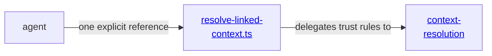

# context tools - as-is

## Purpose

Expose bounded agent-facing context resolution while keeping linked-context implementation and trust rules in `core/modules/context-resolution`.

## Design

**Lineage**: [as-is](../../as-is.md#design) / [tools](../as-is.md#design) / **context tools**

`resolve-linked-context.ts` is a thin tool boundary. It accepts one explicit reference, obtains component context authority from the host environment, and delegates containment, task-record exclusion, provenance, size, and untrusted-content handling to the context-resolution module. It does not discover ambient context, grant component authority, or mutate files.

### Tool boundary view

## Links

- [`resolve-linked-context.ts`](resolve-linked-context.ts) — bounded tool implementation.
- [`../../core/modules/context-resolution/as-is.md`](../../core/modules/context-resolution/as-is.md#design) — host-neutral resolver authority.
