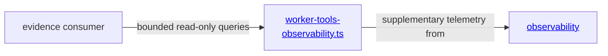

# evidence tools - as-is

## Purpose

Expose bounded, read-only session and trace evidence queries without granting task, validation, recovery, or completion authority.

## Design

**Lineage**: [as-is](../../as-is.md#design) / [tools](../as-is.md#design) / **evidence tools**

`worker-tools-observability.ts` provides exact-ID session analysis and bounded local trace queries. It keeps unavailable, malformed, out-of-scope, and privacy-sensitive observations explicit and delegates no authority to the evidence consumer. Its emitted tool results must never include absolute or indirectly identifying session, store, worktree, component, task-record, log, or configured-directory paths; unsafe nested values are omitted or converted to bounded availability states.

### Tool boundary view

## Links

- [`worker-tools-observability.ts`](worker-tools-observability.ts) — bounded evidence implementation.
- [`../../core/modules/observability/as-is.md`](../../core/modules/observability/as-is.md#design) — supplementary telemetry ownership.
