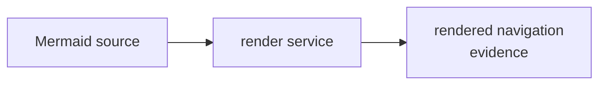

# mermaid renderer - as-is

## Purpose
Provide the bounded Mermaid render service and rendered-navigation scripts used to inspect diagram output without owning component-record structure or navigation authority.

## Design

This runtime home contains `rendered-navigation.ts` and its focused test. The service renders or inspects Mermaid-backed navigation views for repository consumers, while source structure, canonical hrefs, and record meaning remain with the owning record and diagram skills.

**Lineage**: [as-is](../../as-is.md#design) / [tools](../as-is.md#design) / **mermaid renderer**

### Rendered navigation support

This is the F5/A4 runtime-only home retained when the narrative `designing-mermaid-diagrams` skill retired. It was re-homed before the structuring pass at commit `1f9c25e`; the renderer remains a support service and does not replace source or record authority. The tool dir declares mermaid as a dev dependency (`package.json` + `bun.lock`, `node_modules` gitignored): on first run without configuration, the renderer resolves mermaid through bun, bootstrapping one local `bun install` if it is missing, discovers a Chromium-compatible browser on PATH, and derives the version from the resolved package; `MERMAID_BUNDLE` and `MERMAID_RENDERER_VERSION` remain explicit overrides. A host without network access for the bootstrap fails with an explicit unsupported reason.

## Links

- [`rendered-navigation.ts`](rendered-navigation.ts) — rendered-navigation service boundary.
- [`rendered-navigation.test.ts`](rendered-navigation.test.ts) — focused rendered-navigation coverage.
