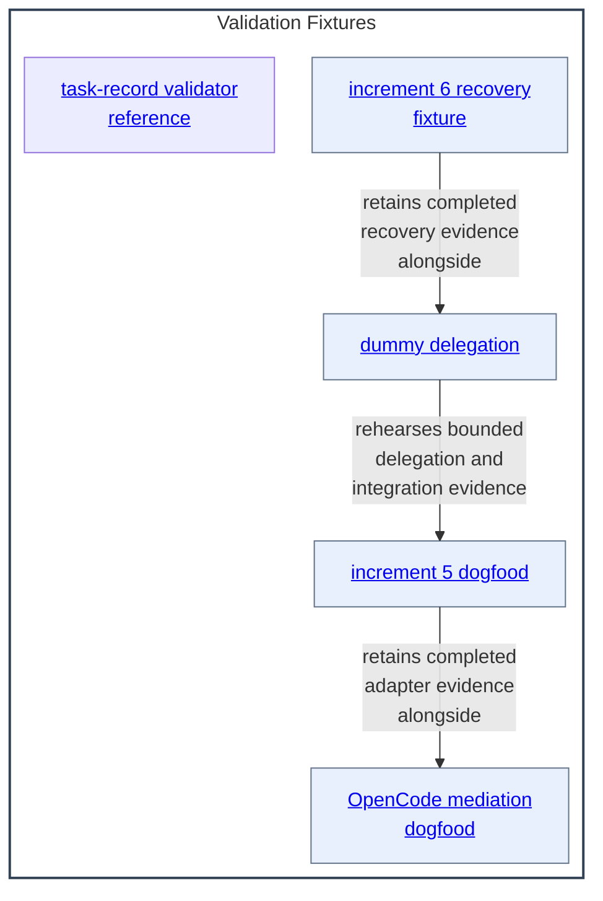

# Validation Fixtures - as-is

## Purpose

Retain harmless, bounded fixtures for validating delegation, host mediation, recovery, and task-record behavior without changing product components or contacting external services.

## Components

| Component | Purpose |
| --- | --- |
| [dummy delegation](dummy-delegation/as-is.md#design) | Rehearse one bounded local delegation, durable registry evidence, and scoped parent integration. |
| [increment 5 dogfood](increment-5-dogfood/as-is.md#design) | Retain completed local dogfood evidence for the Increment 5 OpenCode subprocess adapter. |
| [increment 6 recovery fixture](increment-6-recovery-fixture/as-is.md#design) | Retain completed record-only recovery evidence after private runtime state is unavailable. |
| [OpenCode mediation dogfood](opencode-mediation-dogfood/as-is.md#design) | Retain completed explicit primary-agent mediation evidence for the configured implementer. |
| [Task-record validator reference](task-record-validator-reference/as-is.md#design) | Retain non-runtime Python validator compatibility evidence for the canonical task-control validator. |

## Design

Validation fixtures are independent evidence boundaries. They retain deterministic local rehearsal or concise completed-evidence context for delegation, adapter, recovery, and mediation behavior; they do not become runtime components or product dependencies.

**Lineage**: [as-is](../as-is.md#design) / **Validation Fixtures**

### Fixture containment map

The fixture relationships describe shared validation concerns, not production dependencies. Each linked child box targets the same record as its Components-table entry; that table is the required Markdown and renderer fallback, not a replacement for interactive diagram navigation. This parent's Links retain only distinct fixture-wide context. This parent does not interpret child implementation, tests, task narratives, transcripts, or grandchildren.

## Links

- [`README.md`](README.md) — fixture navigation and retention rationale.
- [`../docs/component-task-record-protocol.md`](../docs/component-task-record-protocol.md) — task-record behavior exercised by the fixtures.
