# Validation Fixtures - as-is

## Purpose

Retain harmless, bounded fixtures for validating delegation, host mediation, recovery, and task-record behavior without changing product components or contacting external services.

## Components

| Component | Purpose |
| --- | --- |
| [dummy delegation](dummy-delegation/as-is.md#design) | Rehearse delegation, budget bubbling, handoff, integration, and cleanup. |
| [increment 5 dogfood](increment-5-dogfood/as-is.md#design) | Validate the selected subprocess adapter in isolation. |
| [increment 6 recovery fixture](increment-6-recovery-fixture/as-is.md#design) | Validate durable recovery when private runtime state is unavailable. |
| [OpenCode mediation dogfood](opencode-mediation-dogfood/as-is.md#design) | Validate explicit primary-agent mediation to the configured implementer. |

## Design

Validation fixtures are independent evidence boundaries. They share the repository's contracts but do not become runtime components or product dependencies.

Parent: [as-is](../as-is.md#design)

```mermaid
%%{init: {"securityLevel": "loose"}}%%
flowchart LR
    subgraph Fixtures["Validation Fixtures"]
        direction LR
        Dummy["<a href='./dummy-delegation/as-is.md#design'>dummy delegation</a>"]
        Increment5["<a href='./increment-5-dogfood/as-is.md#design'>increment 5 dogfood</a>"]
        Increment6["<a href='./increment-6-recovery-fixture/as-is.md#design'>increment 6 recovery fixture</a>"]
        OpenCode["<a href='./opencode-mediation-dogfood/as-is.md#design'>OpenCode mediation dogfood</a>"]

        Dummy -->|rehearses shared handoff boundary with| Increment5
        Increment5 -->|shares adapter evidence boundary with| OpenCode
        Increment6 -->|extends the recovery evidence boundary from| Dummy
    end
    classDef component fill:#f8fafc,fill-opacity:0.1,stroke:#334155,stroke-width:2px
    classDef child fill:#2563eb,fill-opacity:0.1,stroke:#64748b,stroke-width:1px
    class Fixtures component
    class Dummy,Increment5,Increment6,OpenCode child
```

The fixture relationships describe shared validation concerns, not production dependencies. Retained fixture records and their local READMEs remain the authoritative evidence for each scenario.

## Links

- [`README.md`](README.md) — navigation and retention rationale.
- [`../docs/component-task-record-protocol.md`](../docs/component-task-record-protocol.md) — task-record behavior exercised by the fixtures.
