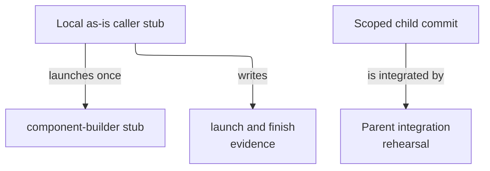

# Dummy Delegation Fixture - as-is

## Purpose
Provide a harmless, deterministic component for rehearsing as-is delegation,
budget bubbling, child commit handoff, parent integration, and cleanup.

## Design

The fixture contains three deterministic local Bun tests: one rehearses an as-is caller that launches exactly one component-builder child through the launcher using local shell stubs and registry evidence; one verifies launcher prompt construction reaches a local child without model latency; and one simulates a parent integrating a scoped child commit while preserving an unrelated file. It retains the completed task-record pair as historical protocol evidence rather than treating process exit as completion authority.

**Lineage**: [as-is](../../as-is.md#design) / [Validation Fixtures](../as-is.md#design) / **Dummy Delegation Fixture**

### Local delegation rehearsal

- Run entirely with local stubs, temporary directories, and Git repositories; do not contact providers or modify product components.
- Verify one bounded component-builder child attempt, caller identity, record path, launch/finish registry evidence, and JSON task-record authority.
- Verify a scoped child commit can be integrated without changing an unrelated parent file.
- Limit the fixture to one child attempt, no nested delegation, and no broad trace or privacy implementation.

## Links

- [`README.md`](README.md) — scenario acceptance and recovery expectations.
