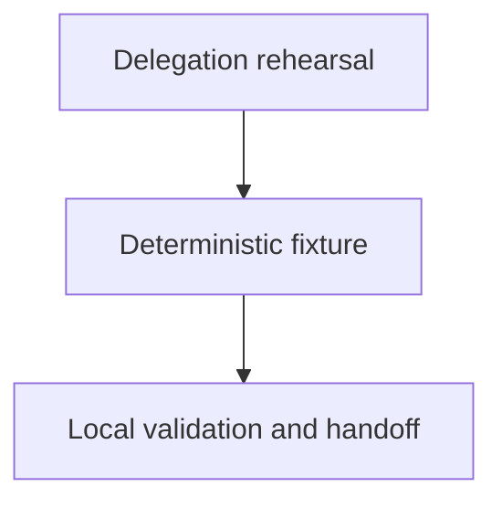

# Dummy Delegation Fixture

## Purpose
Provide a harmless, deterministic component for rehearsing as-is delegation,
budget bubbling, child commit handoff, parent integration, and cleanup.

## Design

The component is organized around the following relationships and flow.

- Contain only a task record, test, and durable context.
- Use a local stub with small cost and wall-clock budgets.
- Rehearse delegation, budget bubbling, child handoff, parent integration, and
  cleanup without contacting providers or modifying product components.
- Limit the fixture to one child attempt, no nested delegation, and no broad
  trace or privacy implementation.

## Links
- [dummy-delegation.test.ts](dummy-delegation.test.ts) — deterministic launcher smoke test.
- [README.md](README.md) — acceptance and recovery expectations.
