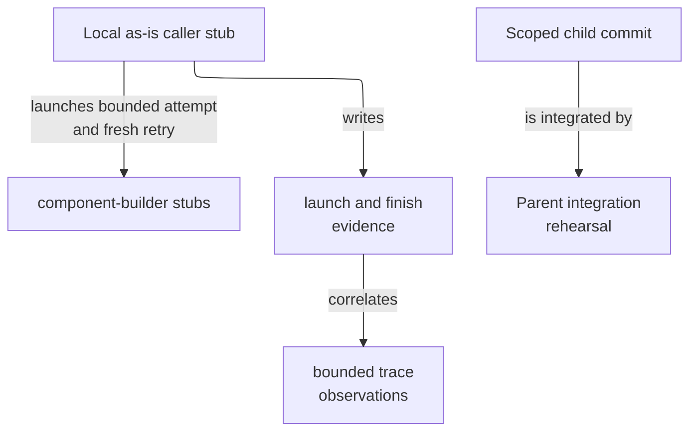

# Dummy Delegation Fixture - as-is

## Purpose
Provide a harmless, deterministic component for rehearsing as-is delegation,
budget bubbling, child commit handoff, parent integration, and cleanup.

## Design

The fixture contains deterministic local Bun tests and one separately gated provider-backed smoke test: one rehearses an as-is caller that launches a component-builder child, records a failed attempt followed by a fresh retry, and reconstructs bounded registry/trace evidence; one verifies launcher prompt construction reaches a local child without model latency; and one preserves the historical parent-integration protocol evidence. The opt-in live test launches a real worker through the launcher and checks bounded registry, trace, and session identity evidence without retaining provider content. It retains task-record evidence as protocol authority rather than treating process exit as completion authority.

**Lineage**: [as-is](../../as-is.md#design) / [Validation Fixtures](../as-is.md#design) / **Dummy Delegation Fixture**

### Local delegation rehearsal

- Deterministic scenarios run entirely with local stubs, temporary directories, and Git repositories; they do not contact providers or modify product components. The separate live smoke test is explicitly opt-in and bounded.
- Verify one bounded parent launch with two component-builder child attempts: a failed attempt and a fresh successful retry with distinct job, trace, and local session identifiers.
- Verify version preflight, task revision/attempt observations, parent-child relationships, retry grouping, outcomes, unavailable fields, and redacted registry/trace evidence.
- Verify a scoped child commit can be integrated without changing an unrelated parent file.
- Keep provider-backed execution separately gated by `AS_IS_LIVE_INTEGRATION=1` and an explicit `PI_BIN`; deterministic tests use only local stubs and never contact providers.

## Links

- [`README.md`](README.md) — scenario acceptance and recovery expectations.
