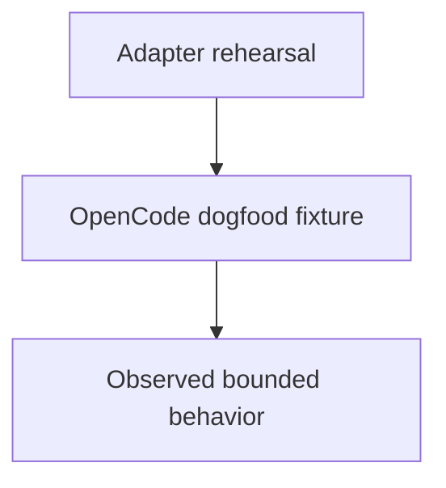

# Increment 5 Dogfood

## Purpose

Provide an isolated child component for validating the selected OpenCode
subprocess adapter without domain changes or external effects.

## Diagram

## Links

- `changelog.md` — concise completed-task history.
