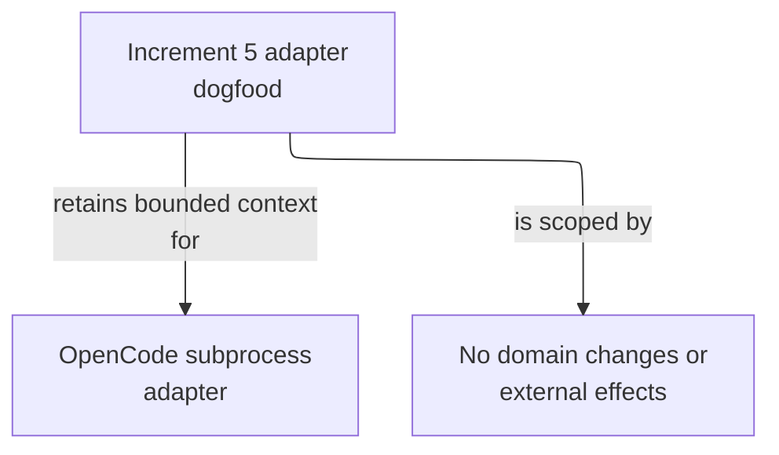

# Increment 5 Dogfood - as-is

## Purpose

Retain a harmless local dogfood fixture for the Increment 5 OpenCode subprocess adapter without domain changes or external effects.

## Design

This component retains the durable navigation and concise history for a completed adapter-validation fixture. Its README names the fixture, while Git history retains detailed transient completion evidence. It does not expose a current runtime adapter, task, or product dependency.

**Lineage**: [as-is](../../as-is.md#design) / [Validation Fixtures](../as-is.md#design) / **Increment 5 Dogfood**

### Adapter-dogfood evidence

