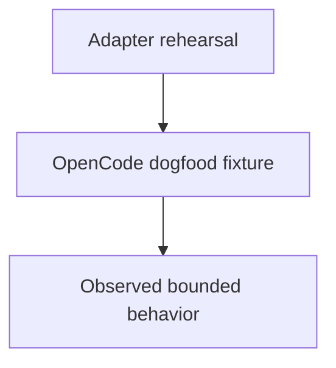

# Increment 5 Dogfood

## Purpose

Provide an isolated child component for validating the selected OpenCode
subprocess adapter without domain changes or external effects.

## Design

The component is organized around the following relationships and flow.

## Links
