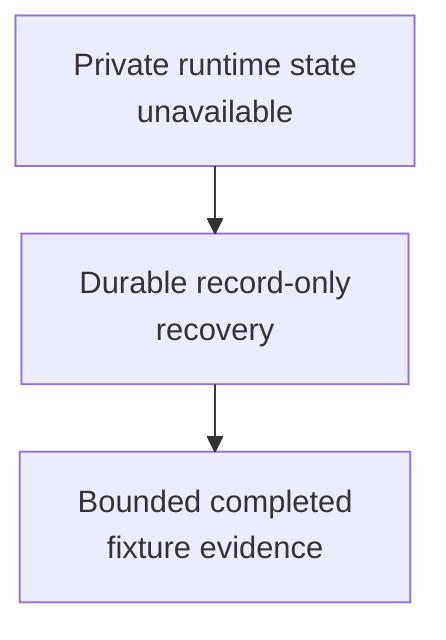

# Increment 6 Recovery Fixture - as-is

## Purpose

Retain a harmless completed fixture that validates recovery from a durable record after private worker runtime state is unavailable.

## Design

This component preserves concise evidence for a completed record-only recovery rehearsal. Git history retains details that recovery preserved the configured worker, cumulative attempt and budget history, a bounded backoff/attempt policy, replacement approval, descendant closure, and cleanup after a local interruption removed private runtime state. It has no descendants and does not expose a current runtime recovery service or product dependency.

**Lineage**: [as-is](../../as-is.md#design) / [Validation Fixtures](../as-is.md#design) / **Increment 6 Recovery Fixture**

### Record-only recovery rehearsal

