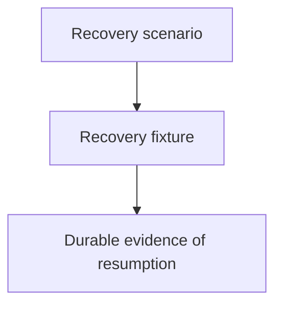

# Increment 6 Recovery Fixture - as-is

## Purpose

Provide a harmless child component for validating recovery from a durable record
after private worker runtime state is unavailable.

## Design

The component is organized around the following relationships and flow.

Parent: [as-is](../../as-is.md#design)

## Links
