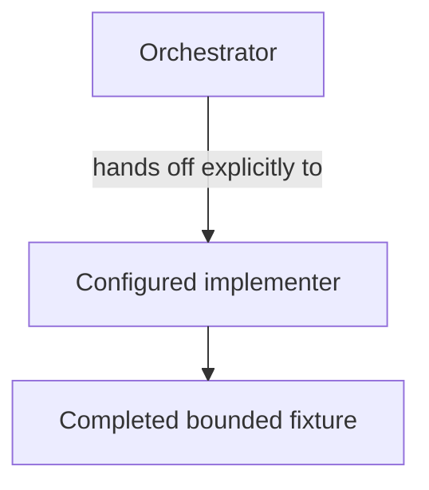

# OpenCode Mediation Dogfood - as-is

## Purpose

Retain a harmless completed fixture that validates explicit primary-agent mediation to the configured implementer.

## Design

This component retains the durable navigation and concise history for a completed OpenCode mediation handoff. Git history retains machine-readable role evidence for an `orchestrator` and parent-linked `implementer`, with no `general` or `explore` mediation, plus the completed worker handoff and parent reconciliation. It does not expose a current mediation service, model setting, or product dependency.

[as-is](../../as-is.md#design) / [Validation Fixtures](../as-is.md#design) / **OpenCode Mediation Dogfood**

### Explicit mediation handoff

- Pre-render layout plan: repository Markdown consumers with no fixed dimensions or configured renderer; narrow top-to-bottom handoff progression; three visible nodes, two short-labeled edges, and concise labels; route explicit mediation from orchestrator to implementer and then outcome as temporal progression; renderer-specific geometry remains untested.

