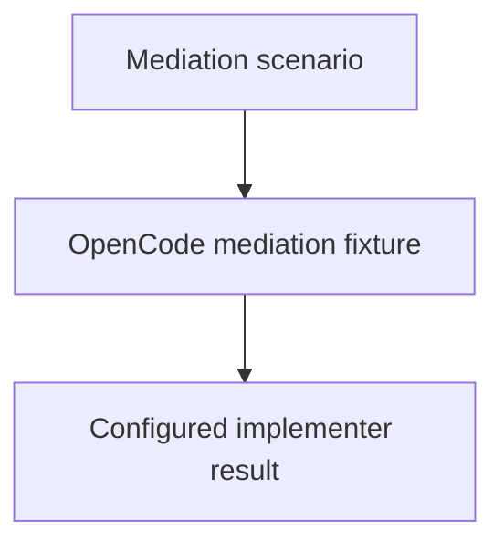

# OpenCode Mediation Dogfood

## Purpose

Provide a fresh harmless child component proving that explicit primary-agent
mediation reaches the configured implementer.

## Design

The component is organized around the following relationships and flow.

## Links
